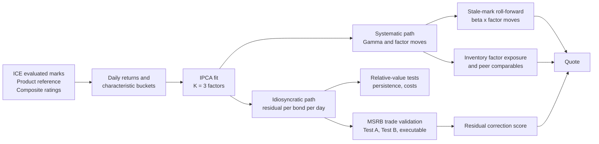

# A Characteristic-Based Factor Model for Municipal Bonds

## Research note for management: what IPCA gives us, what we found, and where it goes next

*Based on the Muni Characteristic Factor Notebook, research window April to
September 2026. Audience: management and desk leads with a working knowledge of
bond markets and basic statistics. Technical detail is kept to what is needed to
judge the conclusions; a glossary is at the end.*

---

## 1. Executive summary

**What we built.** A daily fair-value model for the algo-traded municipal bond
universe, about 236,000 bonds, using Instrumented Principal Components Analysis
(IPCA). IPCA explains each bond's daily price move as a small number of
market-wide factors, with each bond's sensitivity to those factors determined by
its characteristics: rating, coupon, call structure, state, and tenor. What the
model cannot explain is the bond's own idiosyncratic move, the **residual**, and
that residual is the raw material for relative-value and quoting signals.

**What we found.**

1. **IPCA fits the muni cross-section well.** Three factors explain 77% of the
   variance of daily evaluated-price moves across the universe and about 46% of
   the dispersion across bonds on a typical day. The factors are interpretable:
   a duration and callability factor, a long-end and low-grade credit factor,
   and a coupon-structure factor.
2. **The model describes risk, not expected return.** Its ability to forecast
   next-day returns from average factor premia is essentially zero on this
   sample. That is expected over five months of daily data and matches the
   academic evidence. IPCA should be used as a risk and peer decomposition, not
   as a return forecaster.
3. **The residual is predictable, but for the wrong reason for a trading
   strategy.** Residuals persist for about one day. That persistence is
   strongest in bonds whose evaluated marks rarely move, which points to the
   pricing vendor's smoothing, not to a market inefficiency. A daily
   residual-trading strategy breaks even at a 5 basis point round-trip cost,
   far below realistic muni transaction costs.
4. **The residual does tell us where the mark is wrong.** When we compared the
   signal to nearly two million actual MSRB trades, bonds the model called rich
   traded at lower yields than our algo quote, and bonds it called cheap traded
   higher, with the effect concentrated almost entirely in stale-marked bonds.
   That is a **mark-correction signal**, useful for quoting and inventory
   marking, not a standalone arbitrage.

**What we recommend.** Keep IPCA as the systematic fair-value layer. Reposition
the residual output as a conditional relative-value and mark-correction score
feeding the quoting engine, and put the factor side of the model to work too:
rolling stale marks forward by their factor exposure, and measuring the book's
factor exposures for quote skew. Before production, rebuild the pipeline so
every number is computed strictly with information available at the time, move
the model into yield space, and extend the history to at least two years.
Detail in Sections 4.5 and 8.

---

## 2. The problem we are solving

The desk quotes thousands of municipal bonds a day. Most of them have not traded
recently, so the only daily reference price is a third-party evaluated mark. Two
questions follow:

- **Is this bond rich or cheap relative to its peers today?** With 236,000
  bonds and sparse trading, "peers" has to be defined systematically.
- **Is the evaluated mark itself stale?** Evaluated prices are model outputs
  that adjust gradually toward observed trades. A mark that lags the market
  will mislead a quote.

A factor model addresses both. It defines a bond's fair value as what bonds with
the same characteristics did today, and it measures how far the bond's own mark
sits from that fair value.

---

## 3. What IPCA is, in plain terms

Traditional factor analysis (PCA) finds a few common drivers of returns but says
nothing about *why* a bond loads on a driver, and it cannot price a bond that
has no history. Traditional bucket models, such as "AA, 10-year, callable, TX",
are interpretable but rigid and do not adapt when the market rewards one trait
more than another.

IPCA, introduced by Kelly, Pruitt and Su (2019) and applied to corporate bonds
by Kelly, Palhares and Pruitt (2023), combines the two. Each bond's daily
return is written as

```text
return of bond i on day t  =  (characteristics of bond i)  x  Gamma  x  (factor moves on day t)  +  residual
```

- The **factor moves** are the few market-wide drivers on that day, estimated
  from the whole cross-section.
- **Gamma** is a small table, learned from the data, that converts a bond's
  characteristics into its sensitivity to each factor. Two bonds with the same
  characteristics get the same sensitivities, so a newly issued bond is priced
  on day one.
- The **residual** is the part of the move the characteristics cannot explain:
  the bond-specific component.

Why it suits munis:

| Need | How IPCA meets it |
|---|---|
| Very large, sparse universe | Loadings come from characteristics, so bonds with little history are still covered. |
| Interpretability for traders and risk | Gamma shows which traits drive each factor. |
| A defensible "fair value" | Fair value is the factor-explained return; the residual is the rich/cheap measure. |
| Academic grounding | Published methodology with documented performance in equities and corporate bonds. |

---

## 4. How we applied it

### 4.1 Data

| Item | Value |
|---|---|
| Price source | ICE evaluated clean prices, daily |
| Universe | CUSIPs active in the desk's algo trade track |
| Window | 2 April to 16 September 2026, 116 trading days |
| Bonds in the model | 235,722 |
| Bond-days | 26.5 million, 96.8% of the bond-by-day grid filled |
| Return definition | Daily clean-price change; missing moves treated as zero |

### 4.2 Characteristics

Five bond traits, encoded as category buckets, plus a market intercept, for a
total of 46 inputs:

| Trait | Buckets |
|---|---|
| Rating | composite rating letter grade, AAA to CCC-, plus not-rated |
| Coupon | 3, 4, 5, 6, 7+ percent |
| Call | not callable, then time to next call from 0-3 months out to 10 years |
| State | CA, NY, TX, IL, other |
| Tenor | 1 year out to 21+ years in nine bands |

Characteristics are lagged one day so that today's fair value uses only
information known yesterday.

### 4.3 Choosing the number of factors

We fit one to five factors and tested each on three out-of-sample validation
blocks (the first half of May, June, and July), training only on the months
before each block.

| Factors | Out-of-sample fit (Total R²) | Loading stability |
|---|---|---|
| 1 | 0.658 | very stable |
| 2 | 0.667 | stable |
| **3** | **0.671** | **acceptable** |
| 4 | 0.673 | drifting |
| 5 | 0.675 | unstable |

Adding factors beyond three adds less than half a percentage point of fit while
the loadings become noticeably less stable from month to month. We selected
three factors on parsimony grounds.

### 4.4 Pipeline



The fit produces two outputs that serve different purposes. The **systematic
path** (Gamma and the factor moves) is fair value: what a bond with these
characteristics should have done today. The **idiosyncratic path** (the
residual) is the distance of the bond's own mark from that fair value. The
residual cannot contain the systematic move by construction, which is why the
rich/cheap score is built from the residual alone. The systematic path is not
idle; Section 4.5 shows where it enters the quote.

### 4.5 How both paths feed a quote

A quote can be written as the evaluated mark plus four adjustments. Two of them
come from the systematic path, one from the residual path, and one from the
execution optimiser.

| Component | Source | What it does | Status |
|---|---|---|---|
| Evaluated mark | ICE | Starting point | in place |
| Systematic roll-forward | Gamma, factor moves | If the mark has not updated, move it by the bond's beta times the factor moves since it last did | proposed, testable now on cached MSRB data |
| Residual correction | residual, one-day persistence model | Lean away from the mark where the residual says it is stale or off | built and validated in this work |
| Inventory skew | Gamma | Sum beta times position across the book to get the desk's duration, credit and structure exposures; skew quotes to reduce them | proposed |
| Spread and fill terms | quoting optimiser | Bid-ask, fill probability, adverse selection | outside this research |

Two further uses of the systematic path follow directly:

- **Comparables.** A bond's betas are the model's coordinates for "similar
  bonds". Nearest neighbours in beta space, weighted by how closely their
  residuals move together, are the comparables whose recent trade prints
  should anchor an RFQ price. The notebook's peer analysis (Section 8.4) already
  shows this grouping is economically sensible.
- **Uncertainty.** The variance of a bond's expected move splits into a
  systematic part, from the factor moves, and a residual part. Both are needed
  for the confidence band the quoting engine should receive.

The roll-forward can be tested immediately with a variant of Test B: does
"mark plus beta times factor moves" predict the next trade better than the raw
mark, and does adding the residual correction improve it further? One caveat
applies today: with bucket-coded characteristics, every bond in a bucket has the
same beta, so the roll-forward reduces to applying the bucket's average move.
It becomes materially sharper once characteristics are continuous
(Section 8.2, item 2).

What the systematic path should **not** be used for on this sample is
forecasting returns from average factor premia. The predictive R² of 0.03 says
there is nothing there over five months. Factor timing from macro inputs is a
separate line of research and a market-direction bet, not relative value.

---

## 5. What the model tells us about the muni market

### 5.1 Fit

| Measure | Value | Meaning |
|---|---|---|
| Total R² | 0.77 | Share of all daily price-move variance explained by the three factors |
| Cross-sectional R² | 0.46 | On an average day, how much of the dispersion across bonds is explained |
| Time-series R² (median bond) | 0.78 | For a typical bond, how much of its own history is explained |
| Predictive R² | 0.03 | How much is explained using only average factor premia, no same-day information |
| Residual share of variance | about 50% | Bond-specific moves are as large as systematic moves in munis |

The gap between 0.77 and 0.03 is the key read for management. The model is very
good at explaining what happened today once today's market moves are known. It
has no meaningful ability to say in advance which bonds will outperform. That is
the normal result for a risk model and is not a defect; it defines the correct
use.

### 5.2 What the three factors are

Reading Gamma, the largest sensitivities line up as follows.

| Factor | Traits that drive it | Interpretation |
|---|---|---|
| 1 | Long tenor buckets, callable buckets | Duration and curve level, with callability |
| 2 | 16-year-plus tenors, CCC and BB ratings | Long-end and low-grade credit |
| 3 | 3% and 4% coupons, 10-year calls, B- rating | Coupon and structure: discount versus premium, tax treatment |

One caution: the three factor return series move together strongly
(correlations of 0.8 to 0.9 in absolute value). In practice the muni market in
this window was driven by one dominant rate and curve move, with the second and
third factors adding structure around it.

### 5.3 Factor portfolios

Each factor can be expressed as an explicit long-short portfolio of the
underlying bonds, and we verified that these portfolios reproduce the factors
exactly. This matters for two reasons: it makes the factors hedgeable in
principle, and it lets each bond's residual be viewed as a small, factor-neutral
book: long the bond, short its characteristic peers. We do not report Sharpe
ratios for these portfolios because they are computed on evaluated marks, which
smooth returns and inflate any such ratio.

---

## 6. The residual as a signal: what we tested

The residual is the model's rich/cheap measure. We ran a sequence of tests
designed to kill the idea cheaply before spending on data or infrastructure.

### 6.1 Does the residual persist?

Yes, briefly. Today's residual predicts tomorrow's with a correlation of 0.17,
falling to 0.04 after two days and to zero after three. A simple one-day
persistence forecast, estimated each day with only past data, ranks bonds with a
daily rank correlation of 0.22 to next-day residuals. Statistically this is very
strong.

### 6.2 Where does the persistence come from?

Mostly from stale marks.

| Bonds grouped by how much their marks move | Persistence |
|---|---|
| Least active marks (bottom fifth) | 0.32 |
| Middle | 0.18 to 0.26 |
| Most active marks (top fifth) | 0.08 to 0.14 |

Skipping one day between signal and outcome halves the effect. Both patterns are
the fingerprint of an evaluated price that adjusts gradually toward new
information, rather than a market that misprices bonds and corrects.

### 6.3 Can it be traded on marks?

No. A daily long-short book on the residual earns about 6.5 basis points a day
before costs but turns over 2.7 times a day. It breaks even at a round-trip cost
of **4.8 basis points**. Realistic muni round-trips are 20 to 100 basis points
or more, so the strategy is deeply negative after costs at any holding period we
tested.

### 6.4 Does it hold up against real trades?

We joined the residual to MSRB trade prints for the same bonds. About 91% of the
model universe traded at least once in the window, but only 8% of bond-days have
a print, which is why a mark-based model is needed in the first place.

| Test | Question | Result |
|---|---|---|
| Test B, fair value | Does a "cheap" residual predict that the next trade prints above the mark? | Yes: 5.6 bps spread between top and bottom deciles, statistically significant |
| Test A, trade-to-trade | Does the residual predict the return from one trade to the next? | Marginally: 4.8 bps, too small against costs |
| Executable, side-consistent | Buy at an offer print, sell at a later bid print, and vice versa | Ranking works (rank IC 0.03) but the average executable return is minus 46 bps, the bid-ask cost, and the spread of 10 bps does not cover it |
| Final regression, 1.97 million trades | Does the frozen out-of-sample score explain trade yield versus our algo quote, after controls? | Yes, correctly signed and stable across months, but the effect sits almost entirely in the stale-mark quintile |

The last row is the decisive finding. In the stale-mark quintile, moving from
the cheapest to the richest score shifts the trade yield relative to our quote by
about 26 basis points. In the other four quintiles the effect is near zero. The
model is finding bonds whose evaluated mark has not caught up with where they
actually trade.

### 6.5 Verdict on the residual

The residual is a **stale-mark correction and relative-value score**, not a
statistical-arbitrage signal. That is a useful product for a market maker: it
tells the quoting engine when to lean away from the evaluated mark and by how
much. It is not a reason to run a daily trading book on evaluated prices.

---

## 7. Two extensions we tried

**A first attention-based challenger to IPCA.** We built a preliminary version
of a learned peer-weighting model as an alternative way to form factors. It did
not beat IPCA. The version tested used the same bucket inputs as IPCA, so its
peer weights were nearly uniform across the market. The result says nothing
about the approach's potential; it says the challenger needs richer, dynamic
inputs before it is a fair test.

**A first quote-adjustment model.** We tried to predict the gap between our algo
quote yield and the subsequent trade yield from the residual and trade context.
The first version did not beat "no adjustment" on average error, although it
did rank trades with mild success. The likely causes are known and fixable: the
residual is measured in price units while the target is in yield units, and the
regression method used is sensitive to the heavy tails in trade data.

---

## 8. Limitations and recommendations

### 8.1 Limitations of the current work

1. **Short history.** Five months and one rate regime. The factor count, the
   persistence estimates, and the cost gates all need more data.
2. **Evaluated marks are smoothed.** Any statistic computed on them, especially
   volatility and Sharpe, is flattered. We validated against real trades for
   this reason.
3. **Diagnostic versus production residuals.** The residuals used in the trade
   validations were computed with a Gamma fitted on the whole window. The
   one-day forecast layer was point-in-time. The direction of the results is
   robust to this, but production numbers must be recomputed with Gamma
   refit only on past data.
4. **Price units versus yield units.** The model works in price returns while
   the desk quotes in yield. This complicates every comparison to trades.

### 8.2 Recommended next steps

| Priority | Action | Why |
|---|---|---|
| 1 | Rebuild the pipeline so every model component uses only past data, re-executable end to end | Required for any production claim and for audit |
| 2 | Move the model to curve-relative yield changes and use continuous characteristics (years to maturity, years to call, coupon, rating score, yield spread) | Aligns units with quoting; follows the published method more closely; sharpens peer definition |
| 3 | Reposition the output as a mark-correction score with an uncertainty band, and integrate it into the quoting engine as one input alongside inventory and fill probability | Matches what the evidence supports |
| 4 | Use the factor path: test the stale-mark roll-forward against MSRB prints (Test B variant), and compute book-level factor exposures from beta for quote skew | Cheap, uses cached data, and turns the fit into two more quoting inputs (Section 4.5) |
| 5 | Extend the ICE and MSRB history to two or more years | Cover more than one regime before setting factor count and thresholds |
| 6 | Add dynamic liquidity features: days since last trade, recent trade count, side imbalance, mark age | These explain where the signal works and are the prerequisite for a fair attention-model test |
| 7 | Revisit the attention challenger and the quote-adjustment model only after 1 to 6 | Avoid spending on complexity before the base is sound |

Items 1, 2 and 4 are engineering and modelling work of a few weeks each; the
rewrite of the fit exploits the bucket structure and reduces a run from eleven
minutes to seconds, which makes daily refits practical.

---

## 9. Bottom line

IPCA gives the desk a principled, interpretable fair-value decomposition for the
entire muni universe, including bonds that never trade. It explains most of the
daily price variation and identifies the bond-specific component cleanly. That
component predicts where evaluated marks are stale, and it predicts where real
trades print relative to our quotes in exactly those bonds. It does not
constitute a tradeable arbitrage, and the research says so plainly. The right
product is a mark-correction and relative-value input to quoting, built on a
point-in-time version of this model in yield space, with the factor side of the
same fit supplying the stale-mark roll-forward and the book's factor exposures.

---

## Appendix A. Key numbers

| Quantity | Value |
|---|---|
| Bonds modelled | 235,722 |
| Trading days | 116 |
| Characteristics | 46 |
| Factors selected | 3 |
| Total R² (full sample) | 0.77 |
| Cross-sectional R² | 0.46 |
| Predictive R² | 0.03 |
| Residual share of variance | about 50% |
| Residual one-day persistence | 0.17 |
| Persistence, stale versus active marks | 0.32 versus 0.08 to 0.14 |
| Walk-forward one-day forecast, daily rank IC | 0.22 |
| Break-even round-trip cost, daily residual book | 4.8 bps |
| MSRB trades matched to the frozen score | 1.97 million |
| Test B decile spread, trade versus mark | 5.6 bps |
| Score effect on trade yield versus quote, stale quintile | about 26 bps |
| Score effect, other quintiles | near zero |

## Appendix B. Glossary

- **IPCA**: Instrumented Principal Components Analysis. A factor model in which
  each asset's factor sensitivities are functions of its observable
  characteristics.
- **Gamma**: the learned table mapping characteristics to factor sensitivities.
- **Residual**: the part of a bond's daily move not explained by the factors;
  the model's rich/cheap measure.
- **R²**: share of variance explained. Total R² uses same-day factor moves;
  predictive R² uses only average factor premia.
- **Rank IC**: rank correlation between a signal and the outcome it is meant to
  predict, averaged over days. Values above 0.05 are strong in cross-sectional
  finance.
- **Point-in-time (PIT)**: computed using only information available at that
  moment. The standard for any production or backtest claim.
- **MSRB**: Municipal Securities Rulemaking Board, whose RTRS feed reports
  actual muni trade prints.
- **Evaluated mark**: a vendor's daily model price for a bond, used where no
  trade exists.
- **bps**: basis points, one hundredth of a percent.

## Appendix C. References

- Kelly, Pruitt, Su (2019). Characteristics Are Covariances: A Unified Model of
  Risk and Return. *Journal of Financial Economics*.
- Kelly, Palhares, Pruitt (2023). Modeling Corporate Bond Returns. *Journal of
  Finance*.
- Harris, Piwowar (2006). Secondary Trading Costs in the Municipal Bond Market.
  *Journal of Finance*.
