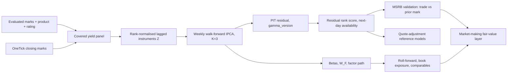

# Characteristic-Based Factor Pricing for Municipal Bonds: IPCA Residuals as a Fair-Value Signal for Market Making

**Research proposal and results, v1.1**
Date: 2026-10-06
Model spec: `step3_yield_ipca_k3_v1` (yield-space IPCA, K = 3, 13 instruments, weekly walk-forward Gamma)
Source: `muni_characteristic_factor_revised.ipynb` (revise-v14), v1.1 transaction audit of 2026-10-01
Audience: quants and traders

---

## Abstract

We fit an Instrumented Principal Components (IPCA) model to daily yield changes of municipal bonds, where each bond's factor loadings are a linear function of its own characteristics. Three latent factors, built from thirteen predetermined characteristics, explain 51% of daily yield-change variance out of sample on a covered universe of 57,573 CUSIPs. The leftover, a per-bond yield residual in basis points, is estimated strictly point-in-time and tested against real MSRB prints. The residual predicts the gap between a trade's yield and the prior evaluated mark: after neutralising date, side and size, a one-unit move in residual rank shifts that gap by 4.8 bp (t = 4.5). It does not predict the gap between the trade and our own algo quote (t = 0.5), so the algo already carries most of the information. The same model yields factor-mimicking portfolios, a factor roll-forward for marks, a book factor-exposure vector, and beta-space comparables. We propose using these as a fair-value layer in the market-making model: mark plus systematic roll-forward plus residual correction, with inventory skew in factor coordinates. The charge-model layer is not yet accepted; the residual adds about 0.004 bp of held-out quote-error improvement over a side-by-size baseline.

---

## 1. Motivation

A municipal bond market maker quotes tens of thousands of CUSIPs that rarely trade. The reference price is an evaluated mark that is published daily, so a quote has to answer two questions the mark does not: how much has the market moved since the information in that mark was formed, and is this bond rich or cheap relative to bonds that share its risk.

A factor model answers both if the loadings are known for every bond, including bonds with no trade history. IPCA (Kelly, Pruitt and Su, 2019) makes loadings a function of observable characteristics, so a bond that has never traded still has a beta. Kelly, Palhares and Pruitt (2023) show this works for corporate bonds with duration, spread, rating and liquidity as instruments. We apply the same structure to municipal yield changes and ask whether the residual carries information a desk can use.

The framing throughout is:

$$
\text{IPCA risk decomposition}\;\rightarrow\;\text{point-in-time residual}\;\rightarrow\;\text{fair-value and quote diagnostics}
$$

not standalone statistical-arbitrage alpha.

---

## 2. Data

| Dataset | Size | Role |
|---|---|---|
| Evaluated-mark panel (ICE, via Deephaven) | 29.7M rows, ~258k CUSIPs, 2026-04-01 to 2026-09-21 | Static fields (coupon, state, call schedule, maturity, latest composite rating); full-universe probe |
| OneTick closing marks (yield, price, duration, DV01) | Covered yield panel: 1.17M rows, 57,573 CUSIPs, 2026-04-02 to 2026-09-21 | Modelling target and continuous characteristics |
| Model panel after filters | 1,108,883 rows, 39,704 CUSIPs, 119 dates | IPCA fit |
| Out-of-sample residuals | 463,188 rows, 25,195 CUSIPs, 57 dates, 12 Gamma versions | All downstream tests |
| AlgoSignal to MSRB matched trades | 129,635 trades, 15,041 CUSIPs, 52 trade dates | Transaction validation |
| Charge dataset (after residual-age gate) | 71,753 joined rows, 63,598 held-out rows, 9 folds | Quote-adjustment models (reference) |

**Target.** The daily closing-yield change in basis points, $r_{i,t} = 100\,(y_{i,t} - y_{i,t-1})$, from internally consistent OneTick marks. Yield space is used so that the term factor does not dominate the loadings the way it does in price space. Rows with a gap of more than seven days between consecutive marks are dropped so the target is a true day-over-day move. The target is clipped at ±250 bp for fitting (0.00% of rows affected).

**Coverage caveat.** The yield panel covers 22% of the evaluated universe, and transaction validation covers the traded subset. All results are conditional on this active, covered population.

---

## 3. Methodology

### 3.1 Model

For bond $i$ on date $t$,

$$
r_{i,t} = z_{i,t-1}'\,\Gamma\, f_t + \varepsilon_{i,t}, \qquad \beta_{i,t} = \Gamma' z_{i,t-1},
$$

where $z_{i,t-1}$ is an $L \times 1$ vector of predetermined characteristics, $\Gamma$ is an $L \times K$ matrix mapping characteristics to loadings, $f_t$ is a $K \times 1$ vector of latent factor realisations, and $\varepsilon_{i,t}$ is the residual. $\Gamma$ is common to all bonds and dates; the cross-section of betas changes every day only because the characteristics change.

### 3.2 Instruments

$L = 13$. Continuous characteristics are lagged one observation and rank-normalised within each date to $[-0.5, 0.5]$, so no characteristic can dominate through scale and the instruments are scale-free across dates.

| Group | Instruments |
|---|---|
| Intercept | `market_fv` = 1 |
| Rate and price structure | modified duration, premium/discount, closing yield level |
| Term and optionality | years to worst, extension (years to maturity minus years to worst, floored at zero) |
| Credit | rating score (latest composite), NR flag (about 56% of bonds) |
| Liquidity | trailing 20-observation mark-change rate |
| Geography | CA, NY, TX, FL dummies |

DV01 is excluded. Its rank correlation with modified duration is 0.998, and in the previous version it produced a factor with +0.71 on duration and −0.70 on DV01, a pure collinearity artifact with gross leverage of 38.6 in the mimicking portfolio.

### 3.3 Estimation

$\Gamma$ is estimated by alternating least squares on per-date cross-products ($Z_t'Z_t$, $Z_t'r_t$, $r_t'r_t$), which makes a fit on a million rows take seconds. Given $\Gamma$, $f_t$ is the cross-sectional least-squares fit; given $\{f_t\}$, $\Gamma$ is the stacked least-squares solution. Identification follows Kelly, Pruitt and Su: $\Gamma'\Gamma = I_K$, factors ordered by variance, signs set so factor means are non-negative. $K = 3$ throughout. A smaller ridge term ($10^{-10}$) stabilises the factor solve.

### 3.4 Point-in-time discipline

Everything downstream of the fit is out of sample.

- $\Gamma$ is refit weekly on past dates only, starting 2026-07-01, giving 12 Gamma versions. Each residual row carries the `gamma_version` that produced it.
- Instruments are lagged and rank-normalised using only that date's cross-section.
- A residual dated $t$ is computed from the close of day $t$, so it becomes available for use at the next business day's open. Transaction tests require `residual_age_days >= 1`.
- The trade-versus-mark target uses the last evaluated mark available before the trade, never the same-day close.
- Activity buckets used in diagnostics are formed from pre-out-of-sample data only.

### 3.5 Factor-mimicking portfolios and the residual-maker

Stack bonds on date $t$: $B_t = Z_t \Gamma$ ($N_t \times K$). The factor realisation is a portfolio of that day's bonds,

$$
f_t = (B_t'B_t + \lambda I)^{-1} B_t' r_t = W_t^{F\prime}\, r_t, \qquad W_t^F = B_t (B_t'B_t + \lambda I)^{-1},
$$

and the residual is the return projected off the beta span,

$$
\varepsilon_t = \big[I - B_t (B_t'B_t + \lambda I)^{-1} B_t'\big]\, r_t .
$$

Each column of $W_t^F$ is the explicit set of bond weights whose return is factor $k$. This gives three things the residual alone cannot: an interpretable factor path, a systematic roll-forward for marks, and a book exposure vector $E_t = \sum_i q_i \beta_{i,t}$.

### 3.6 Residual forecast

The residual's own persistence is tested with an expanding-window AR(1) fit on the previous residual, refit monthly, scored on the next out-of-sample month. Because the raw residual has heavy tails, the AR is fit on residuals winsorised at the training fold's 1st and 99th percentiles, with a `mark_unchanged` state variable (today's mark did not move; 21% of bond-days).

**Design choices.** AR(1) is the minimal model for the hypothesis under test. If evaluated marks partially adjust to information, observed yield changes are a moving average of true changes and the residual shows positive lag-1 autocorrelation, which is exactly the AR(1) slope. It is also the discrete-time form of the mean-reverting residual process assumed in the residual-factor literature, and with at most 57 out-of-sample dates per bond the slope has to be pooled across bonds, so one scalar plus an intercept is as much as the structure can carry. The forecast horizon is one day because a quote tomorrow uses today's close and the residual-age gate is one day.

The monthly block is a reporting convenience. The fit uses all prior out-of-sample months (expanding, not one month), so the September fold trains on July and August. The fitted slope is a single scalar estimated on 150k to 320k pooled pairs and barely moves between refits (raw −0.044 then −0.030; winsorised about +0.02), so a daily refit returns nearly the same number, and frozen monthly blocks keep the AR folds aligned with the Gamma walk-forward for clean reporting. The downstream score is the within-date residual rank, which a positive linear AR leaves unchanged; the slope matters only for a forecast in basis points. The sign flip between raw and winsorised fits and the spread in persistence across activity buckets say the gains lie in model form (a two-regime or activity-dependent forecast), not in refit cadence. In production the regression is cheap enough to refit daily or weekly with a one-day embargo, with the slope path logged as a monitoring signal.

### 3.7 Transaction validation

For each matched trade $\tau$ on bond $i$, the quote error against the prior evaluated mark is

$$
e^{mark}_{i,\tau} = 100\,(y^{MSRB}_{i,\tau} - y^{prior\ mark}_{i}), \qquad
e^{algo}_{i,\tau} = 100\,(y^{MSRB}_{i,\tau} - y^{algo}_{i,\tau}),
$$

regressed on the residual's within-date percentile rank with controls for log size, minutes from signal, benchmark move and side. Pooled OLS is reported as descriptive. Inference uses Fama-MacBeth over the 52 trade dates, and a check that neutralises date, side and size jointly.

### 3.8 Pipeline

---

## 4. Results

### 4.1 Factor structure and fit

**Out of sample, three factors explain 51.2% of daily yield-change variance. The residual standard deviation is 3.4 bp.**

Gamma loadings (full-sample fit, for interpretation only; the production residuals use walk-forward Gamma):

| Instrument | Factor 1 | Factor 2 | Factor 3 |
|---|---:|---:|---:|
| `market_fv` (intercept) | 0.03 | **0.96** | −0.19 |
| modified duration | **0.69** | 0.12 | **0.53** |
| years to worst | **−0.56** | 0.07 | **0.64** |
| extension | 0.10 | 0.09 | **0.50** |
| closing yield | **−0.38** | 0.10 | 0.07 |
| premium/discount | −0.21 | 0.19 | 0.10 |
| rating, NR, liquidity, states | all below 0.05 in absolute value | | |

| | Factor 1 | Factor 2 | Factor 3 |
|---|---:|---:|---:|
| Share of factor variance | 89.2% | 6.7% | 4.1% |
| Factor return mean / sd (bp per day) | 1.56 / 4.29 | 0.72 / 3.45 | 0.41 / 2.57 |
| Mimicking portfolio gross weight | 10.3 | 1.0 | 2.3 |
| Mimicking portfolio net weight | +0.30 | +0.53 | −0.09 |
| Effective breadth (bonds) | 3,813 | 5,938 | 4,560 |

Reading the loadings:

- **Factor 1** loads long on modified duration and short on years to worst and yield level. It separates bonds whose duration is high for their maturity (low coupon, priced to maturity) from those whose duration is short for their maturity (high coupon, priced to call). It carries 89% of factor variance and is the duration-structure factor.
- **Factor 2** is almost entirely the intercept: a parallel shift in yields common to all covered bonds. Its mimicking portfolio is the closest to an equal-weight market basket (gross weight 1.0, breadth 5,938).
- **Factor 3** loads positively on duration, years to worst and extension: a long-end and extension-risk factor.

Credit, liquidity and state instruments carry almost no loading. Over this six-month window the cross-section of daily yield changes is a rate-and-structure phenomenon; credit does not move day to day in evaluated marks.

The residual-maker identity holds: $B_t'\varepsilon_t = 0$ to machine precision, and the explicit projection reproduces the stored walk-forward residual with mean absolute difference below 0.001 bp.

### 4.2 Residual persistence

**The residual has modest, positive persistence in rank space. The raw AR slope is wrong-signed because of the tails.**

| Forecast | OOS daily rank IC | t | Sign accuracy |
|---|---:|---:|---:|
| Raw AR(1) | −0.094 | −2.67 | 0.468 |
| Winsorised AR(1) (1/99, train fold) | +0.094 | +2.67 | 0.547 |
| Winsorised + `mark_unchanged` state | +0.079 | +2.26 | 0.535 |
| Rank AR(1) | +0.094 | +2.67 | 0.529 |

The body of the residual distribution persists and the tails revert. This is a two-regime result, not a nuisance: small residuals are slow mark adjustment, large ones are noise or one-off corrections.

Lag-1 rank IC by activity bucket (pre-OOS volatility quintiles; L1 low, L5 high):

| Bucket | L1 | L2 | L3 | L4 | L5 |
|---|---:|---:|---:|---:|---:|
| Rank IC | +0.081 | +0.066 | +0.070 | +0.081 | **+0.162** |
| t | 3.35 | 2.64 | 2.71 | 3.10 | 5.69 |

Persistence is positive in every bucket and strongest in the most active names.

### 4.3 Transaction validation

**The residual predicts where a trade prints relative to the prior evaluated mark. It does not predict where it prints relative to our algo quote.**

| Target | n | Pooled beta (bp per rank) | Pooled t | FM beta | FM t |
|---|---:|---:|---:|---:|---:|
| Trade minus algo quote | 129,635 | +0.69 | 1.49 | +0.46 | 0.51 |
| Trade minus prior evaluated mark | 129,635 | +4.07 | 8.14 | +3.45 | 1.96 |
| Trade minus prior mark, neutralised by date × side × size | 129,635 | | | **+4.83** | **4.45** |

The pooled t overstates precision because trades on the same day share the factor realisation; the Fama-MacBeth line over 52 dates is the inference line, and the neutralised regression is the cleanest read. In trader terms: moving from the cheapest-ranked to the richest-ranked bond on a given day shifts the expected trade-versus-mark yield gap by about 4 to 5 bp, after removing anything explained by the date, the side and the size.

By trade recency (days since the bond's prior print):

| Recency | ≤1d | 1–3d | 3–7d | 7–21d | >21d |
|---|---:|---:|---:|---:|---:|
| n | 59,421 | 20,110 | 23,450 | 18,883 | 7,527 |
| FM beta | +4.01 | **+5.82** | +4.19 | +1.93 | −0.45 |
| FM t | 3.04 | 3.11 | 2.29 | 0.85 | −0.31 |

By side:

| MSRB side | Dealer-to-dealer (D) | Customer buy (P) | Customer sell (S) |
|---|---:|---:|---:|
| n | 53,555 | 30,658 | 45,422 |
| FM beta | +5.07 | −0.48 | **+7.99** |
| FM t | 4.75 | −0.43 | 4.71 |

The signal lives in names that have printed in the last week and in dealer and customer-sell prints. It is absent for customer buys and for names that have not traded in three weeks.

**Interpretation.** The weak result against the algo quote means the quoting engine already conditions on recent prints and captures most of what the residual knows. The strong result against the mark means the residual is information about the mark, not about the quote. That is where it belongs in the market-making model: as a correction to the reference level, with a decay after about a week of no trading.

**What this is not.** Evaluated marks are republished every day (0.06% of bond-days have an unchanged mark across the 258k universe), so "mark age" is not a usable staleness axis and the result cannot be called a stale-mark effect on that evidence. Whether the mark subsequently revises toward the trade is the decisive test and has not been run.

### 4.4 The systematic path

**The factor path moves marks in the right direction, organises bonds into coherent peer sets, and gives the book an exposure vector.**

*Roll-forward.* Rolling a mark forward by the cumulative factor-implied move, $\hat y_{i,t} = y_{i,s} + \sum_{u} \beta_{i,u-1}' f_u$, versus leaving it unchanged, in panel:

| Horizon (days) | 1 | 2 | 3 | 5 | 10 |
|---|---:|---:|---:|---:|---:|
| Stale-mark MAE (bp) | 2.98 | 4.81 | 6.38 | 9.51 | 16.66 |
| Rolled-mark MAE (bp) | 1.20 | 1.85 | 2.33 | 3.11 | 4.33 |
| RMSE reduction | 34% | 39% | 43% | 49% | 63% |

This is an in-panel diagnostic (the factor on day $t$ is estimated from a cross-section that includes the bond), so it bounds the benefit from above.

*Comparables.* On 2026-09-21, each of 9,300 bonds is matched to its 20 nearest neighbours in standardised beta space. Peer sets are duration-coherent (neighbour-to-random duration distance ratio 0.16) and co-move in yield (correlation of peer-implied and own yield change +0.23 versus −0.01 for random peers). With yield level removed from the embedding to avoid circularity, the distance-weighted peer-implied yield level misses the bond's own yield by 20.0 bp on average, versus 51.6 bp for random peers.

*Book exposure.* $E_t = \sum_i q_i \beta_{i,t}$ aggregates linearly, so a fill of bond $i$ shifts the book's exposure by $\beta_i$. The notebook validates that the duration-aligned factor exposure is monotone across duration-sorted books. Real positions have not yet been plugged in.

---

## 5. Application to the market-making model

The model decomposes a quote into components that each have an owner and an evidence base:

$$
y^{quote}_{i,t} = \underbrace{y^{mark}_{i,s}}_{\text{reference}}
+ \underbrace{\beta_{i}'\,\Delta f_{s\to t}}_{\text{systematic roll-forward}}
+ \underbrace{\kappa\,\hat\varepsilon_{i,t}}_{\text{residual correction}}
+ \underbrace{\theta'\,(E_t \circ \beta_i)}_{\text{inventory skew}}
+ \underbrace{h(\text{side}, \text{size}, \text{recency})}_{\text{spread and charge}}
$$

| Component | Source | Evidence | Proposed status |
|---|---|---|---|
| Systematic roll-forward | $\beta_i$, factor path $f_t$ | In-panel MAE reduction 34% to 63%; Test B gap coefficient +0.07 (t 4.2) on trade-vs-algo error | Shadow: publish the factor-implied move next to the mark |
| Residual correction | PIT residual rank, next-day availability | +4.83 bp per rank on trade vs prior mark (FM t 4.45); decays after one week of no prints; absent for customer buys | Shadow: display as a rich/cheap flag on RFQs with a recent print; gate by side and recency |
| Inventory skew | $E_t$ from positions × betas | Linear aggregation validated; no live positions yet | Research: plug in positions, reconcile with desk duration report |
| Comparables | Beta-space peers, peer-implied level | 20.0 bp vs 51.6 bp random, de-circularised | Shadow: RFQ comparables panel |
| Charge model | Side × size × residual conditional median / quantile | +0.077 bp held-out MAE gain; residual increment ≈ 0.004 bp; quantile models not accepted | Research: not for production |

The residual correction coefficient $\kappa$ should be side- and recency-specific, since the evidence is concentrated in dealer and customer-sell prints within a week of the last trade. The cleanest monetisation test, not yet run, is whether $|y^{trade} - (y^{mark} + \kappa\hat\varepsilon)|$ beats $|y^{trade} - y^{mark}|$ out of sample.

**Go / no-go metrics for shadow mode.** Rolling four-week Fama-MacBeth t of the residual on trade-vs-mark above 2 with a stable sign; factor-1 gross leverage below a fixed ceiling; coverage of the yield panel not falling more than 20%; Gamma drift after sign alignment within tolerance.

---

## 6. Limitations and next steps

**Limitations.**

1. Six months of data, one regime. Factor stability and $K$ selection need more history.
2. Ratings are the latest composite, not point-in-time. The rating instrument has near-zero loading, so the leakage risk to the fit is small, but it should be fixed before the credit dimension is relied on.
3. The covered universe is 22% of the evaluated universe, and transaction tests use matched trades only.
4. Roll-forward and comparables are validated against weak baselines (stale mark, random peers). Desk baselines, duration times benchmark move and rule-based comparables, are the next bar.
5. The pooled versus Fama-MacBeth gap (t 8.1 versus 2.0 on the headline) shows how much of the precision is cross-sectional repetition within a day.

**Next steps, each with the decision it informs.**

| Step | Decides |
|---|---|
| Evaluator-revision test: does the residual predict the next mark revision after a trade? | Whether the residual is mark smoothing (belongs in the reference level) or quote-benchmark bias (belongs in the spread) |
| Mark-side monetisation test: MAE of trade vs corrected mark | The size of $\kappa$ by side and recency |
| Plug real positions into $E_t$ | Whether model-coordinate exposure reconciles with the desk's duration and state reports |
| Broader raw MSRB pull | Whether the trade-vs-mark result holds beyond the matched subset |
| Paired-fold $K$ selection and $W_\beta$ instrument pruning | The production spec |
| Desk-baseline comparisons for roll-forward and peers | Whether the systematic path beats what the desk already does |

---

## Appendix A. Reference tests and comparison steps

These are supporting or comparison exercises. They are not part of the core result but are recorded for completeness.

**A.1 Quote-adjustment (charge) model ladder.** Target: trade yield minus algo yield in bp, winsorised at 0.5/99.5 within the training fold; expanding weekly folds, one-day embargo, 9 folds, 63,598 held-out rows. Acceptance requires beating zero on every fold.

| Model | Held-out MAE (bp) | Gain (bp) | Folds improved | Accepted |
|---|---:|---:|---:|---|
| No adjustment | 13.305 | 0 | 0/9 | |
| Global median de-bias | 13.295 | +0.010 | 4/9 | no |
| Side × size conditional median | 13.232 | +0.073 | 7/9 | no |
| Stale-gated residual median (isotonic, decreasing) | 13.228 | +0.077 | 7/9 | no |
| LightGBM quantile (q50) | 13.077 | +0.227 | 7/9 | no (coverage 82.4% ok, fold gate fails) |
| Linear quantile regression (q50) | 13.048 | +0.256 | 8/9 | no (coverage 83.7% outside 80 ± 3%) |

The residual's increment over side × size is about 0.004 bp. Quantile models output `rv_mu_bps = q50` and `rv_sigma_bps = (q90 − q10)/2.56` per RFQ. The installed LightGBM build does not support monotone constraints with the quantile objective.

**A.2 Roll-forward Test B.** Regressing trade-vs-algo error on the roll-forward gap and the residual over 71,753 matched trades: gap coefficient +0.07 (t 4.3), residual −0.17 (t −3.8), R² 0.0005. The gap coefficient weakens with mark age (1d +0.51, t 4.1; 8–20d +0.01, t 0.7), the opposite of a stale-mark pattern.

**A.3 Circular versus de-circularised comparables.** With yield level in the embedding, peer-implied level MAE is 10.6 bp versus 51.4 bp random. Removing yield level and premium/discount from the Gamma refit raises it to 20.0 bp versus 51.6 bp. The 10.6 bp figure is partly by construction and should not be quoted.

**A.4 Winsorisation sensitivity.** The AR sign flip between raw and winsorised residuals is robust to using rank-transformed residuals (same IC, +0.094). A threshold sweep (1%, 2.5%, 5%) has not been run.

**A.5 Side × size cells.** Within dealer prints, the trade-vs-mark beta is largest in small sizes (5k: FM +11.5, t 4.3; 10k: +5.8, t 3.6) and absent in 100k and above. Customer-buy cells are not significant at any size.

**A.6 Superseded figures.** The −22 bp per rank stale-bucket result from the price-space model, the +4.41 bp per rank (t 8.9) same-day result, and the 9/9-fold charge claim from before the residual-age gate are superseded and should not be cited.

## Appendix B. Metric definitions

- **Variance explained**: $1 - \mathrm{Var}(\varepsilon)/\mathrm{Var}(r)$ over out-of-sample residual rows.
- **Rank IC**: daily Spearman correlation between the forecast and the realised next residual, averaged over days; t = mean / sd × √days.
- **FM beta / t**: daily cross-sectional OLS slope of quote error on residual rank with controls, averaged over trade dates; t from the time series of daily slopes.
- **Neutralised beta**: FM slope after residualising both sides on date × side × size cell means.
- **Gross / net weight**: $\sum_i |w_i|$ and $\sum_i w_i$ of a mimicking-portfolio column; breadth $= (\sum|w|)^2 / \sum w^2$.
- **MAE gain**: held-out mean absolute quote error without adjustment minus with adjustment; bootstrap CI over trades.

## References

- Kelly, B., Pruitt, S., and Su, Y. (2019). Characteristics Are Covariances: A Unified Model of Risk and Return. *Journal of Financial Economics*.
- Kelly, B., Palhares, D., and Pruitt, S. (2023). Modeling Corporate Bond Returns. *Journal of Finance*.
- Epstein, Yu and Pelger (2025), and Guijarro-Ordonez, Pelger and Zanotti (2022), on attention-weighted and residual-based factor portfolios.
- Getmansky, M., Lo, A., and Makarov, I. (2004). An Econometric Model of Serial Correlation and Illiquidity in Hedge Fund Returns. *Journal of Financial Economics*.
- Fama, E., and MacBeth, J. (1973). Risk, Return, and Equilibrium: Empirical Tests. *Journal of Political Economy*.
