# Municipal Bond Characteristic Factors, Residual Dynamics and Algo Error Correction

**Yield-space IPCA K=3 v3 factor model of record, state-space residual signal, and print-level error-correction validation | Research decision note for management, quantitative researchers and traders**

*Jer-Shen Chen · v3.5 · run `muni_ipca_research_v35` on data 2026-01-05 to 2026-09-30 · October 2026*

---

# Abstract

We estimate a three-factor, yield-space Instrumented Principal Components model in which municipal-bond factor loadings are functions of thirteen observable characteristics, and we carry the model through to the quoting engine. On the covered closing-mark panel (1.77 million bond-days, 53,408 CUSIPs, 181 dates), the walk-forward model explains 35.6% of out-of-sample daily yield-change variance with a monthly refit and leaves a point-in-time residual with standard deviation 5.28 bp. Two data rules remove the evaluator artefacts that distorted earlier versions, and the refit-cadence question is closed: monthly, quarterly and frozen Gamma are within 0.3 percentage points of each other. The residual is best described by a pooled state-space filter (near-random-walk drift plus mark noise plus white noise). The filtered drift has daily rank IC +0.083 and a vol-scaled hedged paper Sharpe of 6.8, and the filtered mark noise is a strong mark-quality score (+41.7 bp of trade-versus-mark error per unit, t = 14.9). The residual signal predicts where evaluated marks go; it does not predict where trades print relative to the algo quote (−0.14 bp per rank unit, t = −0.18).

The deployable result sits one layer down. The algo quote's own pricing error persists from one matched print to the next with coefficient +0.59 (t = 22.9), the quote's existing last-value adjustment is already right-sized (−0.037, so there is no mis-scaled term to fix), and a two-parameter rule that adds 0.8 × EWMA of past errors (half-life three prints) lowers held-out MAE against the print from 12.95 to 12.26 bp (+0.68 bp, Fama–MacBeth t = 8.1, block-bootstrap t = 6.1) on 537,845 held-out trades. The gain is concentrated where the factor framework says it should be: single-A callables (+18 to +22 bp in two cells), 4–6 year bonds (+2.0 bp), short bullets (+1.8 bp) and the high slope-beta tercile (+1.5 bp); it is zero or negative in AAA and in the 6–8 year belly. In dollars of price the rule removes about $2.5 million a month of the quote's $30 million a month of absolute error on the held-out prints, nine tenths of it in single-A callables. The gain is largest on the bid (+1.4 bp on dealer purchases against +0.5 bp on dealer sales and +0.2 bp inter-dealer), and in the sub-one-year and short-callable cells it helps the bid and hurts the offer, so the deployable rule must be side-aware. The algo's error loads on the slope factor (−30.8 bp per unit beta2, t = −4.2) and the correction removes that loading; a direct factor-beta correction does not work on its own (−0.29 bp). A LightGBM level model reaches +1.55 bp but is not yet an object we would deploy. For the quote band, a fixed width rescaled on a ten-day window covers 78% at 11.2 bp and is more efficient than every conditional band we tried. The evidence supports deploying the EWMA error-correction rule in the identified cells behind a shadow period, promoting the state-space outputs as marks-and-risk tooling, and keeping the level model and conditional bands as challengers.

# 1. Motivation and Research Question

This study asks three questions in sequence. First, do observable municipal-bond characteristics explain the cross-section of daily evaluated-yield changes well enough to give a stable factor model of record? Second, does the unexplained component carry short-horizon information, and if so about what: the next evaluated mark, or the next trade? Third, where the quoting engine is wrong, does the factor framework tell us where and why, and can a bounded correction be validated against printed trades?

The earlier versions of this work (v1 to v2.3) answered the first question and found the residual's information to be mark-relative rather than quote-relative. The v3 programme accepts that finding and pivots: it keeps the factor model and the residual as the common-risk and marks layer, and tests the quote's own error history as the object to correct. The notebook finds a stable factor model, a residual that is a mark-dynamics object, and a persistent algo error whose correction is statistically and economically meaningful in specific characteristic cells. It does not establish a causal mechanism, and it covers five out-of-sample months with one dispersion cycle.

# 2. Data

| **Dataset** | **Size** | **Role** |
|---|---|---|
| Closing-mark panel (Step 3 pipeline output) | 1,894,388 rows, 77,379 CUSIPs, 2026-01-05 to 2026-09-30 | Target and continuous characteristics |
| Closing marks, deduplicated | 2,680,659 rows, 106,117 CUSIPs | Yield, price, duration lookups |
| Model panel after filters | 1,772,768 rows, 53,408 CUSIPs, 181 dates, L = 13 | IPCA fit |
| Residuals of record (monthly refit) | 1,195,848 rows, 44,359 CUSIPs, 123 dates, 7 Gamma versions | All downstream residual tests |
| AlgoSignal-to-MSRB matched trades | 13,741,255 raw rows; 9,645,961 after match filter and trade-id dedup; 6,743,756 in the OOS window | Transaction validation |
| Trades joined to a prior residual | 624,171 trades, 31,493 CUSIPs, 125 trade dates, median residual age 3 days | Signal-to-print tests |
| Error-correction held-out set | 537,845 trades in five monthly folds (May to September) | Baselines A to H and the level model |
| Band held-out set | 344,397 trades in three monthly folds (July to September) | Quote-band calibration |

**Filters applied before the fit.** Rows with a zero duration and a long maturity are excluded (5,792 rows, 0.31%). Yield outliers are flagged per date by a robust z-score (7,048 rows, 0.37%); the target is capped so that 284 rows (0.015%) with a daily move above 250 bp do not drive the moments. Dates with fewer than 1,000 priced bonds are dropped (five dates). Ratings use the final composite rating with a fallback to the composite field; 18.2% of bond-days remain unrated and carry the NR flag.

**Coverage boundary.** The closing-mark panel covers the OneTick-priced subset of the municipal universe, and all transaction tests are conditional on the trades that match an AlgoSignal quote. Results should be read as statements about the quoted universe, not the whole market. The 20.5% of bond-days whose evaluated mark does not move are retained in the fit and tracked throughout.

## 2.1 The two data rules

The v5 run showed that two kinds of evaluator days were distorting the model. The v3 notebook makes them explicit rules, fixed before the run.

| **Rule** | **Definition** | **Treatment** | **Dates caught in this sample** |
|---|---|---|---|
| Dispersion day | More than 10% of bonds move more than 10 bp *relative to the day's median move* | Zero weight in the ALS moments; residuals still produced and flagged | 2026-05-27, 2026-09-17, 2026-09-28 |
| Common-move day | Absolute median move above 10 bp | Flagged and kept in the fit | 2026-03-20, 03-24, 07-23, 09-10, 09-23, 09-24, 09-28 and others |
| Partial-mark day | Bonds priced below 60% of the trailing 20-date median count | Dropped | 2026-04-22 |

> **Why "relative to the median" matters.** An evaluator-wide reprice is a day on which many bonds move a lot *in different directions* after the day's common move is taken out: the evaluator is re-levelling individual bonds. A day on which the whole curve moves 15 bp is a market day, and the factor model is exactly the tool meant to explain it. The raw rule used in v4 and v5 (share of bonds with a large absolute move) flagged twelve dates, eight of which were common-move days. Zero-weighting those eight threw away the most informative curve days of September, and that is why the v5 run reported a frozen Gamma beating the weekly refit. With the relative rule the order reverses and the cadence question closes.

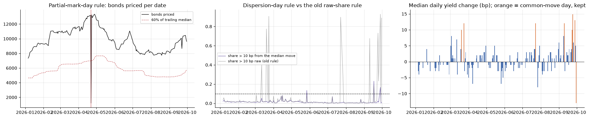

# 3. Research Design and Pipeline

Conceptual orientation only. Quantitative evidence is reported in Section 5.

### Step 1 — Data, characteristics and data rules
Construct the bond-date panel from closing marks and lagged security characteristics; apply the dispersion, common-move and partial-mark rules so that the moments the model sees are market days.

↓

### Step 2 — Conditional factor fit and refit cadence
Estimate the three-factor yield-space IPCA model by date-weighted alternating least squares. Refit monthly on an expanding window; run quarterly and frozen refits on identical test dates to settle the cadence question.

↓

### Step 3 — Residual construction and residual dynamics
Define the point-in-time residual as the observed yield move less the characteristic-conditioned common component. Describe its dynamics with a state-space model (persistent drift, mark noise, white noise) and take the filtered drift as the residual signal of record and the filtered mark noise as a mark-quality score.

↓

### Step 4 — Mark tooling
Use the factor path to roll stale marks forward, locate every bond in beta space, and form point-in-time beta-space clusters for the breakdowns that follow.

↓

### Step 5 — Transaction validation of the residual
Join the lagged signal to subsequent MSRB prints. Test the signal against the prior evaluated mark and against the existing algo quote with date-aware inference.

↓

### Step 6 — Algo error correction and quote band
Build the print-to-print panel of the algo's own error; estimate correction rules on prior months only; validate held-out MAE against the print by age, side, characteristic cell and beta-space cluster; calibrate a quote band around each mid and compare it to a fairly rescaled fixed band.

**Research boundary.** This workflow maps the thesis and sequencing; it does not itself establish significance, economic value or production readiness. Those rest on the walk-forward design, the residual-age controls, the Fama–MacBeth and block-bootstrap inference, the pre-registered choices in Appendix B, and the cell-level evidence in Section 5.

# 4. Methodology

## 4.1 Model

For bond *i* on date *t*, the daily closing-yield change in basis points is

Δyi,t = zi,t′ Γ ft + εi,t = βi,t′ ft + εi,t,   βi,t = Γ′ zi,t.

Here zi,t is an L = 13 vector of predetermined characteristics, Γ is the L × K map from characteristics to loadings, ft is the K = 3 vector of latent factor realisations, βi,t is the bond-specific loading vector and εi,t is the residual. Γ is common across bonds and dates; the cross-section of betas changes as characteristics change. The specification is a conditional decomposition, not a causal model.

## 4.2 Instruments

Continuous characteristics are lagged one observation and rank-normalised within each date to approximately [−0.5, 0.5], so the inputs are scale-free across dates. OTHER is the omitted geography.

| **Group** | **Instruments** |
|---|---|
| **Intercept** | *market_fv* = 1 |
| **Rate and price structure** | Duration ratio (modified duration divided by years to worst), premium/discount, closing-yield level |
| **Term and optionality** | Years to worst and extension, defined as years to maturity minus years to worst, floored at zero |
| **Credit** | Rating score from the composite rating and an NR flag (18.2% of bond-days) |
| **Liquidity** | Trailing 20-observation mark-change rate |
| **Geography** | CA, NY, TX and FL indicators (12.2%, 5.4%, 18.8%, 4.5% of rows) |

DV01 is excluded, as in v1: its rank correlation with duration is 0.998 and it produced a mechanically offsetting factor with gross leverage near 39. The duration instrument is the ratio to years to worst rather than raw duration, so that it measures convexity and coupon structure rather than repeating the term axis; the largest off-diagonal instrument correlation is 0.49.

## 4.3 Estimation

Γ is estimated by alternating least squares on per-date cross-products, which avoids materialising the full 1.77-million-row design matrix. Conditional on Γ, each ft is a cross-sectional least-squares fit with a small ridge term; conditional on the factor path, Γ is updated from the stacked system. Identification follows the IPCA convention: Γ is orthonormalised, factors are ordered by variance and signs are chosen so factor means are non-negative.

> **Date weighting.** Each date's moments enter the Γ update with weight inversely proportional to that date's cross-sectional mean squared target, capped at four times the median weight. Without this, a handful of high-dispersion days contribute most of the squared variation and dominate the estimate of Γ, which is how the June step in the v4 mimicking-portfolio leverage arose: a late-May evaluator day entered the expanding window and re-levelled the factor map. With inverse-variance weights the kept dates span a weight range of 0.08 to 4.0 and the step disappears. Dispersion days receive weight zero.

The number of factors is K = 3. In-sample date-weighted variance explained rises from 0.219 at K = 1 to 0.244 at K = 2, 0.251 at K = 3, 0.254 at K = 4 and 0.255 at K = 5. The third factor is the last one that both adds fit and has an economic name (Section 5.1); the fourth and fifth add 0.3 and 0.2 points of in-sample fit, have no stable loading pattern across Gamma versions and raise the mimicking-portfolio leverage. K sensitivity was closed in v2.3 and is not re-run here.

## 4.4 Point-in-time discipline and refit cadence

- Γ is refit on an expanding window at month-end, beginning 2026-03-31, giving seven Gamma versions over the out-of-sample window 2026-04-01 to 2026-09-30. Each residual row carries the version that produced it.
- Quarterly and frozen (fit once at 2026-03-31) refits are run on identical test dates so that the cadence comparison is like for like. A dispersion-regime-conditional Gamma was run in v3.0 and dropped once the cadence question closed.
- Continuous instruments are lagged and rank-normalised within the contemporaneous cross-section.
- A residual dated *t* is computed from the close of day *t* and is available from the next business day. Transaction tests join each trade to the last residual strictly before the trade's signal time; median residual age is three days.
- Activity buckets are trailing-20 target volatility per bond, lagged one observation and ranked into quintiles within each date, so every bond-day gets a bucket from past data only.
- The error-correction coefficients, the side intercepts, the factor-beta coefficients and the level model are all estimated on months strictly before the test month.
- The beta-space clusters used in the breakdowns are fitted on the first out-of-sample month and applied forward with fixed centroids.

## 4.5 Factor-mimicking portfolios, the residual-maker and Gamma alignment

Stack the bonds observed on date *t* into the beta matrix Bt. The factor realisation is a portfolio of that day's yield changes:

ft = (Bt′Bt + λI)−1 Bt′ Δyt = Wt′ Δyt,   Wt = Bt(Bt′Bt + λI)−1,

and the residual is the yield change projected off the beta span, εt = [I − Bt(Bt′Bt + λI)−1Bt′] Δyt. Each column of Wt is the set of bond weights whose return realises one factor, which gives an interpretable factor path, a systematic roll-forward of stale marks and a book exposure vector in model coordinates.

> **Two details that were wrong before and are fixed here.** First, the gross weight of a mimicking portfolio depends on how the factors are rotated: any orthonormal rotation of Γ leaves the fit unchanged but changes each column's gross weight. We therefore report, alongside the per-factor gross weight, the rotation-invariant Frobenius leverage √tr[(B′B)−1], which is a property of the beta span alone. Second, comparing Γ across refit versions needs the versions to be in the same rotation. Each version is aligned to the first by an orthogonal Procrustes rotation (the orthogonal matrix that brings one Γ closest to another in least squares). The mean across-version standard deviation of the loadings falls from 0.040 raw to 0.020 aligned, which is the stability figure we quote.

## 4.6 Residual dynamics: the state-space model

The earlier versions modelled the residual with an AR(1). The v4 result that the AR(1) was "dead" (Pearson lag-1 autocorrelation −0.05 while the Spearman was +0.06) was not a failure of persistence but a mis-specified model: the residual contains a mark-noise component that reverses one day later and dominates the linear moments, while a small persistent component survives in the ranks. The v3 model of record writes the residual as the sum of three things:

rt = mt + ηt − ηt−1 + εt,   mt = φ mt−1 + ξt,

where mt is a slowly moving drift (the persistent rich/cheap state), ηt is mark noise that enters today and leaves tomorrow (an evaluator placing the mark a little off and correcting it), and εt is white noise. Four parameters (φ and the three standard deviations) are estimated by maximum likelihood on a Kalman filter over 2,000 bonds per fold, with increments winsorised at the 1st and 99th percentiles. The filter then gives, for every bond and date, the best estimate of mt (the signal of record) and of ηt (the mark-noise estimate used as a mark-quality score).

> **What the Kalman filter is doing, in plain terms.** Each day the filter holds a belief about the bond's hidden drift and how uncertain that belief is. When a new residual arrives, the filter asks how much of it to attribute to a real change in the drift and how much to a transient mark error. If mark noise is large relative to drift changes, a big residual is mostly discounted and the drift estimate barely moves; if the drift is volatile, the estimate follows the residual closely. The weights are not chosen by hand: they fall out of the four estimated variances. The same model, written as a moving-average filter, is the ARMA(1,1) the v4 review asked for, so fitting an ARMA separately would re-estimate the same object with a less interpretable parameterisation; that experiment was run in v2.3 and closed.

Two reference forecasters are kept for comparison: the trailing 20-day mean of the residual (the "level" signal) and a ten-lag ridge filter ("LongConv-lite"). The by-activity-bucket version of the state-space model is run as a diagnostic; the pooled version is the pre-registered signal of record.

## 4.7 Transaction validation

For each matched MSRB print the mark-relative error is emark = 100 × (ytrade − yprior mark) and the quote-relative error is ealgo = 100 × (ytrade − yalgo), both in basis points. Each is regressed on the signal's within-date percentile rank with controls for log trade size, minutes from signal time and the side-specific MMD spread change. MSRB sides are coded S (dealer sells to customer), P (dealer buys from customer) and D (inter-dealer).

> **Fama–MacBeth and the block bootstrap.** Trades on the same date share market information, so a pooled regression overstates precision. The primary inference runs the regression separately on each of the 125 trade dates and reports the mean slope with a t-statistic from the dispersion of the daily slopes (Fama–MacBeth). Daily slopes can themselves be autocorrelated across adjacent days, so we also resample the daily slopes in five-day blocks 500 times and report the bootstrap t. Where the two disagree, the bootstrap t is the one to believe; in this sample the ratio of bootstrap to Fama–MacBeth t ranges from 0.61 to 1.01, and every headline result survives both.

The mark-quality reading regresses |trade − prior mark| on the state-space mark-noise estimate |η̂|, and the dealer round trip (P yield minus S yield on the same bond-day) on the same quantity.

## 4.8 Algo error correction

The quoting engine's yield for a bond is the MMD yield plus a side-specific MMD spread plus a last-value adjustment. Its error at a print is ealgo. The print-to-print panel pairs consecutive matched prints of the same bond (120,021 pairs, median gap 3.8 days) and regresses the second error on the first, on the factor move between the two prints and on the residual move between them. The correction rules then use, for each trade, only prints that occurred before its signal time:

- *last_algo_err*: the algo error at the most recent prior matched print, and its age;
- *ewm_algo_err*: an exponentially weighted mean of prior errors with a half-life of three prints;
- *n_prior_prints* and *same_side_as_last*.

The baselines, all estimated on months strictly before the test month:

| **Label** | **Mid** | **What it tests** |
|---|---|---|
| A | Algo quote | The incumbent |
| B | A + ρ(age bucket) × last error | A one-print memory |
| C | A + ρ × EWMA of past errors | A smoothed memory; two parameters |
| E | A + per-side intercept | Side bias alone |
| F | E + ρ × EWMA | The "revised third term": side intercept plus smoothed memory |
| G | A + b′β (factor-beta correction) | Does correcting the factor exposure directly work? |
| H | F + b′β | Memory plus factor exposure |
| D | LightGBM level model with the error features | How much is there to get |
| D− | The same without the error features | What the error features add |

Gains are reported as held-out MAE against the print and as the daily Fama–MacBeth mean of |eA| − |emid|, with FM and bootstrap t.

## 4.9 The quote band

For an 80% target, five bands are placed around each mid on the three held-out months: a fixed half-width calibrated on the training months; a fixed half-width rescaled each day on the trailing ten days (the fair benchmark); a raw gradient-boosted quantile band; split conformal, which rescales the quantile band by the empirical 80% quantile of the normalised score on the previous month; and rolling conformal, which does the same on a ten-day window.

> **Why conformal, and why a rolling fixed band is the fair benchmark.** A quantile model's band can be well shaped (wider where errors are larger) and still mis-covered, because the model's quantiles are only as good as its training period. Conformal prediction fixes the level: it computes how large the realised errors were relative to the band on a calibration window and inflates or deflates the band so that the target coverage held there. It guarantees coverage on exchangeable data, which September was not. A conditional band therefore earns its place only if it beats a fixed band that was given the same recalibration opportunity; that is the rolling fixed band. We compare on efficiency, defined as half-width per point of coverage, lower being better.

## 4.10 Where the gains live

The universe MAE hides the structure the factor model is built to see. Every held-out trade is tagged with its duration bucket, call structure (bullet, callable priced to maturity, priced to call), rating bucket, state, liquidity quintile, factor-beta tercile and point-in-time beta-space cluster (k-means with eight centroids fitted on standardised betas in April and applied forward). Gains are reported per segment and for every duration × call × rating cell with at least 2,000 trades. A Fama–MacBeth regression of each mid's error on the three betas asks whether the quote misses a factor axis. The dollar view multiplies the error removed on each trade by par × price/100 × modified duration × 10−4, which converts a yield error into dollars of price.

## 4.11 Pipeline

1. Build the bond-date panel from closing marks and lagged characteristics; apply the three data rules.
2. Estimate date-weighted IPCA with K = 3 on an expanding monthly window; keep residuals with Gamma-version lineage; run quarterly and frozen refits on identical dates.
3. Align Gamma versions by Procrustes; build betas, mimicking weights and the rotation-invariant leverage; map the beta space and fit the point-in-time clusters.
4. Fit the pooled state-space model per fold; publish the filtered drift as the signal of record and the filtered mark noise as the mark-quality score; run the vol-scaled hedged paper portfolio as the information metric.
5. Join signals to MSRB prints strictly before the trade; run Fama–MacBeth and block-bootstrap tests against the prior mark and the algo quote.
6. Build the print-to-print algo error panel; estimate baselines A to H and the level model on prior months; report held-out MAE by age, side, segment, cell and cluster, the factor loading of each mid's error, and dollars removed.
7. Calibrate the five bands around the algo quote, the revised third term and the level model; report coverage, half-width and efficiency against the rolling fixed benchmark.
8. Roll stale marks forward with the factor path and report RMSE reduction by horizon and segment.

# 5. Results

## 5.1 Factor Structure and Fit

**Estimation.** The unbalanced panel of 1,772,768 bond-days is estimated by date-weighted alternating least squares with masked observations, warm starts, QR normalisation and a small ridge term. Three dispersion days receive zero weight; the remaining 177 dates carry weights between 0.08 and 4.0.

| **Table 1. Factor count and out-of-sample fit** | | | |
|---|---|---|---|
| **K** | **In-sample variance explained (date-weighted)** | **ALS iterations** | |
| 1 | 0.2194 | 3 | |
| 2 | 0.2439 | 6 | |
| 3 | 0.2505 | 7 | selected |
| 4 | 0.2538 | 7 | |
| 5 | 0.2553 | 8 | |

| **Table 2. Out-of-sample variance explained by month and refit cadence (identical test dates)** | | | | | |
|---|---|---|---|---|---|
| **Month** | **Monthly (record)** | **Quarterly** | **Frozen at 2026-03-31** | **Residual sd (bp)** | **Target sd (bp)** |
| 2026-04 | 0.1512 | 0.1512 | 0.1512 | 7.02 | 7.62 |
| 2026-05 | 0.1643 | 0.1600 | 0.1600 | 6.48 | 7.09 |
| 2026-06 | 0.1236 | 0.1225 | 0.1225 | 4.78 | 5.11 |
| 2026-07 | 0.5022 | 0.5023 | 0.5034 | 3.73 | 5.29 |
| 2026-08 | 0.4582 | 0.4583 | 0.4591 | 2.64 | 3.58 |
| 2026-09 | 0.6569 | 0.6558 | 0.6480 | 4.50 | 7.69 |
| **All** | **0.3561** | **0.3549** | **0.3533** | **5.28** | |

| **Table 3. Gamma of record (full sample), loadings sorted by size** | | | | |
|---|---|---|---|---|
| **Instrument** | **Factor 1 (level)** | **Factor 2 (slope)** | **Factor 3 (yield tilt)** | **Norm** |
| market_fv | 0.939 | −0.324 | −0.076 | 0.997 |
| z_closing_yield_lag1 | −0.168 | −0.226 | −0.893 | 0.936 |
| z_years_to_worst | 0.252 | 0.764 | −0.102 | 0.811 |
| z_extension | 0.149 | 0.477 | −0.313 | 0.590 |
| z_duration_ratio | −0.041 | −0.111 | 0.183 | 0.218 |
| z_premium_discount_lag1 | 0.024 | −0.132 | −0.091 | 0.162 |
| z_rating_score | −0.009 | −0.032 | −0.147 | 0.150 |
| state_CA | −0.015 | −0.026 | −0.135 | 0.138 |
| nr_flag | −0.011 | −0.009 | 0.061 | 0.063 |
| z_liquidity_20, state_NY, state_FL, state_TX | | | | below 0.05 |
| **Variance share** | **50.6%** | **40.2%** | **9.3%** |  |
| **Factor sd (bp/day)** | **3.37** | **3.00** | **1.44** |  |

**Paper-reference note.** Kelly, Palhares and Pruitt report K = 3 out-of-sample individual-bond total R² of 45.3% for monthly U.S. corporate-bond excess returns with 30 instruments. The 35.6% here is for *daily* evaluated-yield changes on municipal bonds with 13 instruments, a far noisier target; the two are directionally consistent and not like for like. Our own v1 number (51.2% on a shorter, calmer sample) is not comparable either, because the v3 window includes the April to June period in which the common factor explained little of the daily move.

> **Metric definitions and interpretation.** *Out-of-sample variance explained* is 1 − Σ(Δy − Δŷ)² / ΣΔy² over all out-of-sample bond-days, using the Gamma in force on each date; it is uncentred, so the denominator is squared yield changes around zero. *Residual sd* is the standard deviation of the point-in-time residual in basis points. *Rank IC* is the Spearman correlation, computed within each date, between a signal and the next observed residual of the same bond, averaged across dates; its t-statistic uses the dispersion of the daily values. *Hedged Sharpe* is the annualised Sharpe ratio of a daily long-short paper portfolio in residual space, weights proportional to the signal scaled by each bond's trailing volatility, with the factor exposures hedged out; it is an information metric about the signal, not a tradable return, because evaluated marks are not executable. *MAE gain* is the daily Fama–MacBeth mean of |algo error| − |mid error| in basis points, positive when the mid is closer to the print than the algo quote. *Coverage* is the share of held-out prints inside the band and *efficiency* is half-width in bp divided by coverage in points, lower being better.

**Finding 1 — Three factors are legible and stable, and the third is the last one worth keeping.** Factor 1 is the parallel level move (market_fv 0.94). Factor 2 is the term or slope move: long years-to-worst and high extension bonds move with it, short bonds against it. Factor 3 is a yield tilt: high-yielding bonds move against low-yielding ones, with a secondary callable (extension) and California component. The shares are 50.6%, 40.2% and 9.3%. Rating, liquidity and the state indicators carry loadings below 0.15 and are kept because they are cheap and interpretable, not because they move the fit. Across the seven Gamma versions the aligned loading standard deviation is 0.020. Adding a fourth factor adds 0.3 points of in-sample fit and no stable pattern.

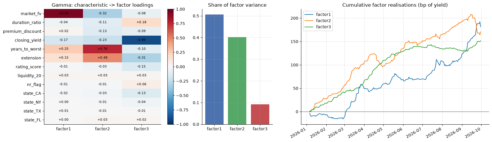

**Finding 2 — The refit cadence does not matter, so the cheapest cadence is the right one.** Monthly, quarterly and frozen Gamma explain 0.356, 0.355 and 0.353 of out-of-sample variance on identical test dates; no month differs by more than 0.9 points, and September, the only stress month, favours the monthly refit by 0.9 points. The v5 result that a frozen Gamma beat a weekly refit was an artefact of the raw dispersion rule zero-weighting September's curve days (Section 2.1). The pre-registered record is the monthly refit; a weekly refit buys nothing.

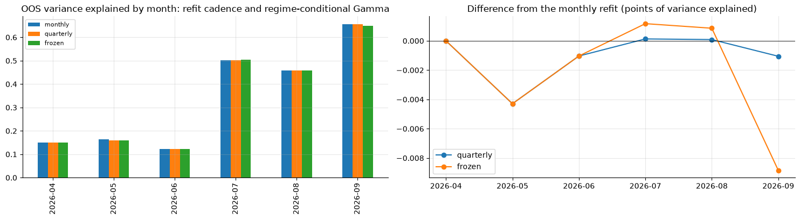

**Finding 3 — The fit is regime-dependent and the residual is the quiet-market object.** Variance explained is 0.12 to 0.16 in April to June, when the target sd was 5 to 8 bp and most of the daily move was idiosyncratic, and 0.46 to 0.66 in July to September, when the common factors returned. The residual sd falls from 7.0 bp in April to 2.6 bp in August and rises to 4.5 bp in September. The downstream residual tests are therefore tests on a residual whose scale moves by a factor of three; the vol scaling in the paper portfolio and the normalised conformal score exist for this reason.

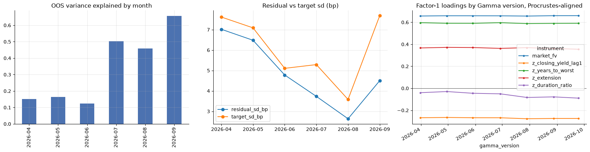

**Mimicking portfolios.** Across dates the gross weight of the three factor portfolios averages 3.26, 2.67 and 2.77 with the aligned Gamma (3.40, 2.26 and 2.97 raw), with net weights 0.60, −0.81 and 0.05 and effective breadth of 4,700 to 6,500 bonds; the factors are realised by broad, modestly levered portfolios, not by a handful of bonds. The maximum |B′ε| across dates is 2.5 × 10−9, confirming that the residual is orthogonal to the beta span. The June step in the v4 leverage path is gone. The rise in gross weight from August into September appears in the rotation-invariant leverage as well, so it is a real change in the beta span during the stress period, not a rotation artefact.

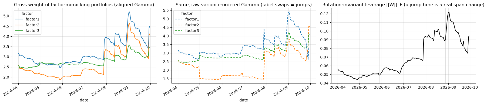

**Beta space.** The three betas place every bond in a space where distance is factor exposure rather than label. Figure 7 shows the September snapshot; the eight clusters separate cleanly into short bullets, intermediate bullets, 4 to 6 year priced-to-call, 6 to 8 year priced-to-call and long callables, and the rich/cheap ranking inside a cluster produces named comparables (Figure 8). The point-in-time clusters used in Section 5.5 are the April fit applied forward; their labels (duration, share callable, extension) appear in the cluster rows of Table 11.

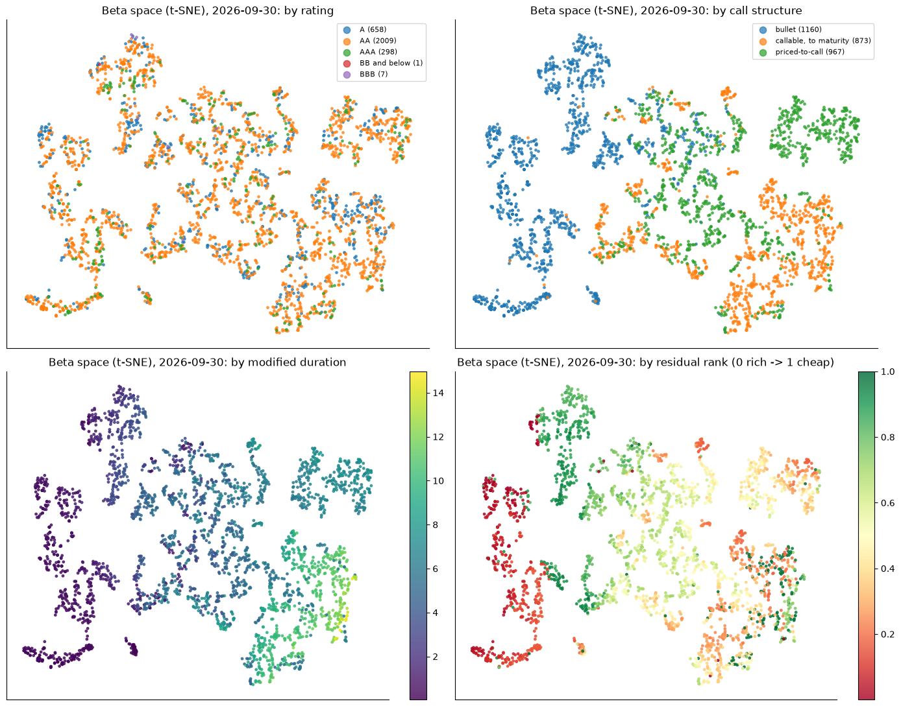

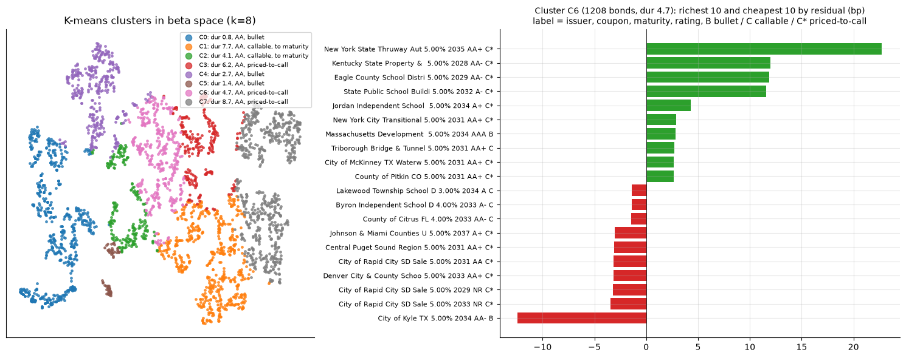

## 5.2 Residual Dynamics

**Notebook evidence — autocorrelation.** On 1.15 million consecutive residual pairs, the lag-1 Pearson autocorrelation is −0.052 and the Spearman is +0.058 (Bartlett band ±0.002); the Spearman stays between +0.05 and +0.08 through lag 10 while the Pearson is zero from lag 2. Excluding dispersion days changes neither. This is the signature of the model in Section 4.6: a transient mark-noise component that reverses once and dominates the linear moments, and a small persistent component in the body of the distribution.

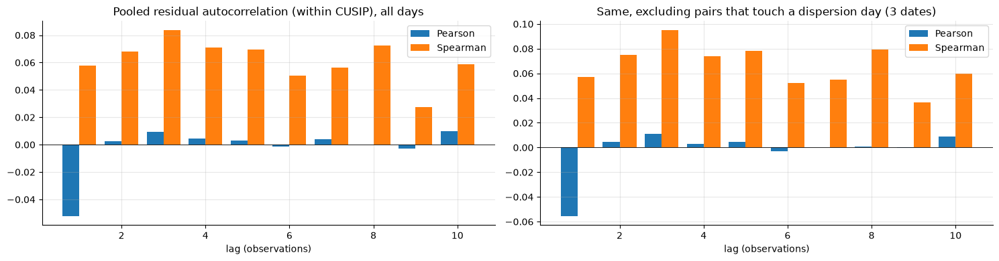

| **Table 5. Residual forecasters on five expanding monthly folds (next residual of the same bond)** | | | | | |
|---|---|---|---|---|---|
| **Forecaster** | **Rank IC** | **IC t** | **Sign accuracy** | **IC ex dispersion days** | **Hedged Sharpe (vol-scaled, all)** |
| Trailing-20 mean (level signal) | +0.082 | 8.0 | 0.508 | +0.080 | 2.90 |
| LongConv-lite ridge, 10 lags | +0.070 | 5.4 | 0.535 | +0.072 | 2.61 |
| **State-space, pooled (record)** | **+0.083** | **7.5** | **0.546** | **+0.086** | **6.78** |
| State-space, by activity bucket | +0.061 | 5.7 | 0.526 | +0.065 | 5.65 |
| Walk-forward selected signal (by prior-month Sharpe) | | | | | 5.80 over 102 days |

| **Table 6. State-space parameters, pooled, by fold** | | | | | |
|---|---|---|---|---|---|
| **Fold** | **φ (drift persistence)** | **sd drift shock** | **sd mark noise** | **sd white noise** | **Log-lik per obs** |
| 2026-05 | 0.943 | 0.196 | 0.553 | 2.338 | −2.345 |
| 2026-06 | 1.000 | 0.002 | 0.678 | 2.257 | −2.328 |
| 2026-07 | 1.000 | 0.004 | 0.542 | 2.040 | −2.209 |
| 2026-08 | 0.989 | 0.061 | 0.410 | 1.949 | −2.143 |
| 2026-09 | 0.982 | 0.067 | 0.492 | 1.785 | −2.082 |

**Finding 4 — The residual is a near-random-walk drift under mark noise and white noise, and the filter that knows this is the best forecaster.** The drift persistence φ is 0.94 to 1.00 with a shock sd of 0.00 to 0.20 bp; mark noise has sd 0.4 to 0.7 bp; white noise has sd 1.8 to 2.3 bp. The drift is tiny and almost permanent, which is why the trailing mean, an unweighted estimate of the same object, is nearly as good a forecaster (IC 0.082 against 0.083) but a much worse portfolio (Sharpe 2.9 against 6.8): the filter's weighting of recent residuals and its handling of unchanged marks give it twice the sign accuracy margin (0.546 against 0.508). The by-bucket filter, pre-registered in v3.0 as the record, is worse (IC 0.061, Sharpe 5.65) and the parameter table says why: in the two most active quintiles the drift persistence collapses to zero and the fit is unstable. The record is the pooled filter; the by-bucket filter stays as a diagnostic.

**Finding 5 — The body continues and the tails revert.** Conditional on the current residual, the next residual continues with a ratio of 0.10 to 0.15 in the central 90% of the distribution and reverses in the top and bottom 1% (continuation −0.05). Excluding dispersion days sharpens both. A linear AR(1) averages over the two regimes and reports nothing; the winsorised filter and rank-based signals see the body. This closes the AR(1) and the raw-ARMA questions from the v4 review.

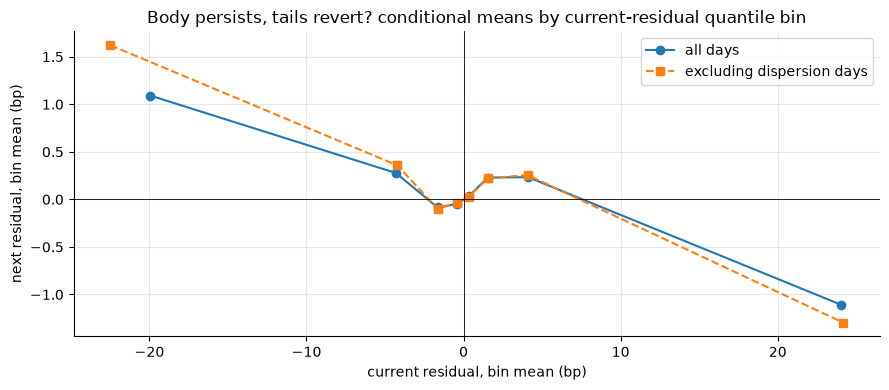

**Finding 6 — The hedged paper portfolio is an information metric, and on that metric the filter is strong.** The pooled filter's vol-scaled, factor-hedged portfolio earns 0.32 bp per day of residual with a Sharpe of 6.78 over 121 days (4.26 unhedged); it is selected in every walk-forward month and the selected-signal Sharpe is 5.80. The Sharpe is 3.9 to 4.6 within every activity quintile, so the result is not carried by stale marks. These are returns on evaluated marks, which cannot be executed, so the figure measures how much the filter knows about where marks go and nothing else.

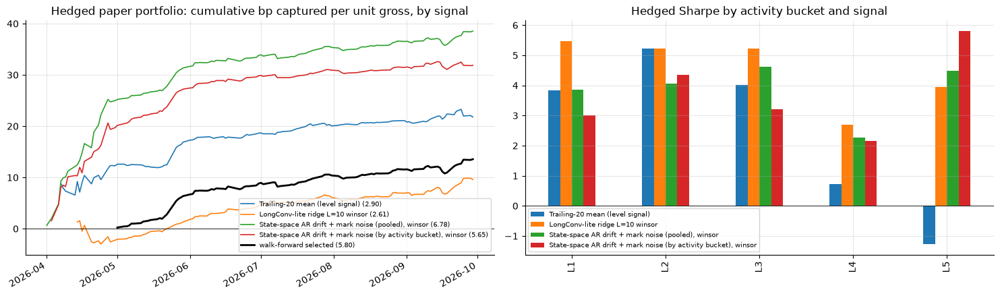

## 5.3 Transfer to Transactions

**Notebook evidence.** 624,171 held-out prints are joined to a residual strictly before their signal time.

| **Table 7. Fama–MacBeth over 125 trade dates (bp per rank unit)** | | | | | |
|---|---|---|---|---|---|
| **Score** | **Target** | **n** | **FM slope** | **FM t** | **Bootstrap t** |
| One-day residual rank | trade − prior mark | 624,171 | +2.10 | 2.9 | 1.8 |
| One-day residual rank | trade − algo quote | 624,171 | −0.84 | −2.0 | −2.0 |
| Trailing-mean rank | trade − prior mark | 491,095 | −3.13 | −4.1 | −2.7 |
| Trailing-mean rank | trade − algo quote | 491,095 | −2.85 | −4.6 | −3.4 |
| **State-space rank (record)** | **trade − prior mark** | **410,723** | **+1.15** | **1.3** | **1.2** |
| State-space rank (record) | trade − prior mark, neutralised date × side × size | 410,723 | +1.27 | 1.5 | |
| **State-space rank (record)** | **trade − algo quote** | **410,723** | **−0.14** | **−0.2** | **−0.1** |
| State-space rank, side S | trade − prior mark | 138,756 | +2.95 | 2.5 | 2.4 |
| State-space rank, side P | trade − prior mark | 113,274 | −1.45 | −1.8 | −1.7 |

| **Table 8. Mark-quality reading** | | | | | |
|---|---|---|---|---|---|
| **Test** | **n** | **FM slope** | **FM t** | **Bootstrap t** | |
| \|trade − prior mark\| on \|residual\| / vol | 624,171 | +2.59 | 7.9 | 5.6 | |
| **\|trade − prior mark\| on state-space mark noise \|η̂\|** | **410,723** | **+41.7** | **14.9** | **11.7** | bp per unit |
| Dealer round trip (P − S yield, same bond-day) on \|η̂\| | 66,007 | +2.24 | 4.8 | 3.3 | median round trip 5.8 bp |

**Finding 7 — The residual signal predicts marks, not prints, and the mark-noise estimate is a mark-quality score.** Against the prior mark the record signal has a positive slope of +1.15 bp per rank unit that does not reach significance, with the whole effect on the dealer-sale side (+2.95, t 2.5). Against the algo quote it has nothing (−0.14, t −0.2), on all days and excluding dispersion days. The trailing-mean signal is wrong-signed against prints (−3.1 bp, t −4.1), which is the two-regime result of Finding 5 seen through trades: trades print against stale levels. The joint regression of the three scores is collinear and is not reported. By contrast the filtered mark noise |η̂| is a very strong predictor of how far a print will land from the mark (+41.7 bp per unit, bootstrap t 11.7) and of the dealer round trip. The right place for the residual layer is therefore marks and risk tooling (Section 6), not the quote.

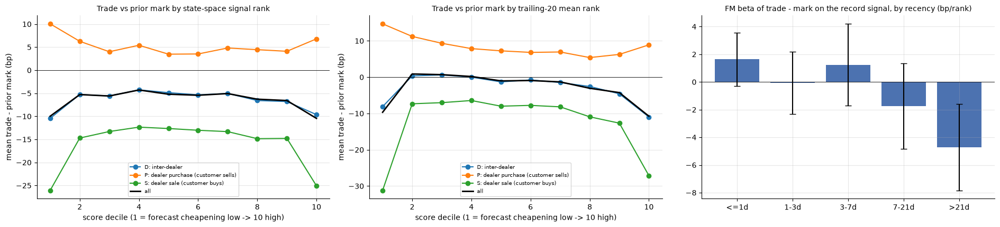

## 5.4 Algo Error Correction

**Notebook evidence — persistence.** On 120,021 consecutive matched print pairs (median gap 3.8 days), the algo error at the second print regressed on the first gives +0.586 (FM t 22.9, bootstrap t 17.7). The factor move between the prints enters with −0.08 (t −1.2) and the residual move with −0.22 (t −5.0): prints follow the factor move and ignore the residual move, consistent with Finding 7. Persistence by gap is 0.42 within one day, 0.42 at one to three days, 0.48 at three to seven, 0.37 at seven to fourteen and 0.31 at fourteen to thirty days; it is 0.58 when the two prints are on the same side and 0.51 when they are on opposite sides, so it is not a side bias. 99.9% of held-out trades have a prior matched print before their signal time.

**Notebook evidence — the quote's own third term.** The algo quote already carries a last-value adjustment. Regressing the error on that adjustment gives −0.037 (t −3.9): a slight over-reaction, −0.06 on the inter-dealer side and 0.00 on dealer sales. The correlation between our last-error feature and the quote's adjustment is +0.09, and +0.06 for the EWMA. The persistence is therefore information the quote does not use, not a mis-scaled version of a term it already has.

| **Table 9. Held-out MAE against the print and daily Fama–MacBeth gain over the algo quote (537,845 trades, May to September)** | | | | |
|---|---|---|---|---|
| **Mid** | **MAE (bp)** | **Gain (bp)** | **FM t** | **Bootstrap t** |
| A algo quote | 12.95 | | | |
| B algo + ρ(age) × last error | 13.18 | −0.23 | −4.0 | −3.3 |
| **C algo + ρ × EWMA error** | **12.26** | **+0.68** | **8.1** | **6.1** |
| E algo + side intercept | 12.85 | +0.09 | 4.9 | 3.3 |
| F = E + ρ × EWMA (revised third term) | 12.29 | +0.64 | 7.0 | 5.3 |
| G algo + factor-beta correction | 13.23 | −0.29 | −19.0 | −13.5 |
| H = F + factor-beta correction | 12.23 | +0.71 | 8.5 | 6.4 |
| D LightGBM level model with error features | 11.44 | +1.55 | 21.1 | 13.7 |
| D− level model without error features | 11.76 | +1.26 | 15.8 | 10.1 |
| **Headline excluding duration < 1 year (474,662 trades)** | A 8.76 · C 7.77 · F 7.84 · G 9.00 · D 7.55 | | | |

| **Table 10. Gain of the EWMA rule C by residual age and MSRB side (bp, FM t)** | | | |
|---|---|---|---|
| **Bucket** | **n** | **Gain C** | **t** |
| age ≤ 1 day | 234,369 | +0.90 | 6.9 |
| age 1–3 days | 96,105 | +0.73 | 4.4 |
| age 3–7 days | 104,140 | +0.41 | 2.0 |
| age 7–21 days | 78,254 | +0.64 | 4.2 |
| age > 21 days | 24,685 | −0.30 | −2.3 |
| side D (inter-dealer) | 202,235 | +0.11 | 1.0 |
| side P (dealer buys) | 154,995 | +1.61 | 17.9 |
| side S (dealer sells) | 180,615 | +0.55 | 5.6 |

**Finding 8 — The algo's error is persistent and a two-parameter smoothed memory removes a reliable part of it.** The EWMA coefficient estimated on prior months rises from 0.77 in May to 0.84 in September as the training set grows; the age-bucket coefficients for the single-print rule rise in parallel from 0.3–0.56 to 0.44–0.58. The single-print rule B hurts (−0.23 bp) because one print is noisy; the EWMA rule C gains +0.68 bp with bootstrap t 6.1 and is positive in every age bucket below 21 days and on both customer sides. The side intercepts add nothing on top (F is C with noise added: side biases are P +2 to +4 bp, D −1, S +0.5, and they shrink over the sample). The deployable object is C: algo quote + 0.8 × EWMA of past algo errors with a three-print half-life.

**Finding 9 — Correcting the factor exposure directly does not work; correcting the error history does, and it also fixes the factor exposure.** The direct factor-beta correction G is worse than the algo quote (−0.29 bp, t −19) in every segment; added to F it adds 0.07 bp (H). Yet the algo quote's error loads on the slope factor: Fama–MacBeth of the error on the betas gives +12.5 bp per unit β1 (t 2.7), −30.8 per unit β2 (t −4.2) and zero on β3. Under the revised third term the β2 loading is +0.8 (t 0.1) and β1 falls to 8.8. Under the level model it flips to +17.6 (t 3.0), an over-correction. The reading is that the quote mis-prices along the term axis in a way that is bond-specific and persistent; the per-bond error history carries it, a universe-wide beta coefficient cannot.

**Finding 10 — The level model shows how much is there, not what to deploy.** The LightGBM level model reaches +1.55 bp, of which 0.3 bp comes from the error features (D− is +1.26). The v5 ablation showed the model depends on the side-specific MMD spread change, and its error loading on β2 is wrong-signed. It is the ceiling against which the two-parameter rule is measured, and the rule gets 44% of the way there with two numbers.

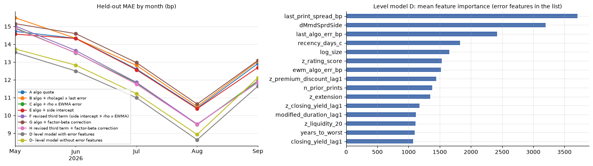

## 5.5 Where the Gains Live

The universe gain of +0.68 bp hides a very uneven map, and the unevenness is the point: the factor framework identifies the cells where the quote is wrong in a persistent way.

| **Table 11. Gain over the algo quote by segment (bp, FM t), revised third term F and level model D** | | | | | |
|---|---|---|---|---|---|
| **Segment** | **Share of trades** | **Algo MAE** | **Gain F** | **t** | **Gain D** |
| Rating A | 14% | 18.8 | **+4.02** | 9.0 | +4.16 |
| Rating AA | 72% | 12.6 | +0.22 | 2.6 | +1.36 |
| Rating AAA | 12% | 8.7 | −0.45 | −5.3 | +0.16 |
| Bullets | 37% | 8.6 | **+1.40** | 10.5 | +1.63 |
| Callable, priced to maturity | 9% | 11.5 | +0.65 | 1.3 | +0.83 |
| Priced to call | 55% | 16.1 | +0.13 | 1.2 | +1.64 |
| Duration 1–2.5 y | 24% | 11.4 | +0.87 | 5.8 | +1.32 |
| Duration 2.5–4 y | 15% | 8.0 | +0.87 | 7.0 | +1.37 |
| Duration 4–6 y | 20% | 9.3 | **+2.01** | 12.2 | +2.26 |
| Duration 6–8 y | 24% | 5.8 | −0.28 | −4.4 | +0.01 |
| Duration 8–11 y | 4% | 12.6 | **+2.88** | 2.7 | +3.20 |
| Duration < 1 y | 12% | 44.4 | −1.15 | −2.6 | +3.99 |
| Liquidity Q2 | 20% | 14.2 | +1.44 | 7.8 | +2.18 |
| β3 tercile high | 33% | 10.6 | **+1.50** | 11.5 | +1.93 |
| β3 tercile low | 33% | 14.1 | +0.07 | 0.5 | +1.43 |
| β2 tercile high | 33% | 7.6 | +0.93 | 6.6 | +1.26 |
| Cluster C0 (1.1 y bullets) | 13% | 13.9 | +2.04 | 2.4 | +1.81 |
| Cluster C4 (1.5 y bullets) | 12% | 9.1 | +1.30 | 7.7 | +1.78 |
| Cluster C1 (7 y callables) | 33% | 7.5 | +0.62 | 4.1 | +0.91 |
| Cluster C7 (1.4 y callables, extension 5.9) | 6% | 45.7 | −1.88 | −4.1 | +2.20 |
| Side P, dealer buys (bid) | 29% | 12.7 | **+1.43** | 10.8 | +2.46 |
| Side S, dealer sells (offer) | 34% | 13.0 | +0.46 | 4.6 | +1.27 |
| Side D, inter-dealer | 38% | 13.1 | +0.20 | 1.8 | +1.14 |

| **Table 12. Top and bottom duration × call × rating cells by the gain of F (cells with at least 2,000 trades)** | | | | | |
|---|---|---|---|---|---|
| **Cell** | **n** | **Algo MAE** | **MAE F** | **Gain F (bp)** | **t** |
| 8–11 y, callable to maturity, A | 3,129 | 39.2 | 15.3 | **+22.1** | 6.1 |
| 4–6 y, priced to call, A | 7,357 | 32.6 | 12.0 | **+18.4** | 11.5 |
| 1–2.5 y, bullet, A | 11,169 | 17.1 | 12.9 | +4.1 | 3.1 |
| 2.5–4 y, priced to call, A | 3,958 | 12.1 | 9.3 | +2.8 | 3.5 |
| 1–2.5 y, bullet, AA | 60,085 | 10.6 | 8.8 | +1.8 | 11.2 |
| 2.5–4 y, bullet, AA | 35,009 | 8.2 | 6.6 | +1.7 | 7.2 |
| 4–6 y, priced to call, AA | 47,766 | 8.8 | 7.5 | +1.2 | 6.1 |
| 4–6 y, callable to maturity, AA | 2,533 | 10.6 | 11.8 | −1.3 | −6.1 |
| < 1 y, priced to call, AA | 46,527 | 45.0 | 46.8 | −1.8 | −6.2 |
| 8–11 y, callable to maturity, AA | 8,417 | 8.4 | 10.9 | −2.7 | −1.6 |
| < 1 y, priced to call, A | 8,038 | 50.3 | 53.7 | −3.5 | −2.5 |

**Finding 11 — The gains sit in single-A callables, intermediate bonds and short bullets, and the quote is already right in AAA and the 6–8 year belly.** In two A-rated callable cells the quote's MAE falls from 33 to 39 bp to 12 to 15 bp, a gain of 18 to 22 bp on 2% of trades. Single-A bonds as a group gain 4.0 bp (t 9.0), 4 to 6 year bonds 2.0 bp (t 12.2), bullets 1.4 bp (t 10.5) and the high yield-tilt tercile 1.5 bp (t 11.5). In AAA (−0.45 bp) and the 6 to 8 year belly (−0.28 bp) the quote is already well behaved and a correction only adds noise. The sub-one-year and near-call segments have quote MAEs of 40 to 120 bp, which is yield-space noise on bonds whose yield is barely defined; even there the split is by call structure, with sub-one-year bullets gaining 14 bp and sub-one-year priced-to-call bonds losing 2 bp (Figure 16). They dominate the universe MAE and should be reported separately, which is why the headline excluding duration below one year (8.76 to 7.77 bp) is the number to quote.

**Finding 13 — The residual signal's information is also concentrated, in the short end.** Within clusters the record signal's rank IC is 0.10 to 0.15 in the two sub-one-year clusters and 0.07 in the short callables, against 0.01 to 0.05 elsewhere, and the within-cluster hedged Sharpe is highest in the short callables C7 (4.9) and the 4 year callables C3 (3.7). Against prints the within-cluster slopes are small and mixed. The two layers divide the map: the residual layer knows most about the short idiosyncratic end, where the quote's own error is noise; the error-correction layer works in the intermediate and single-A cells, where the quote's error is persistent.

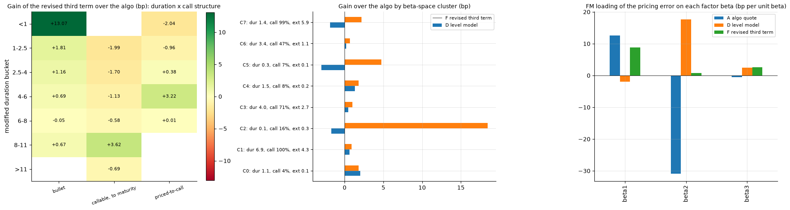

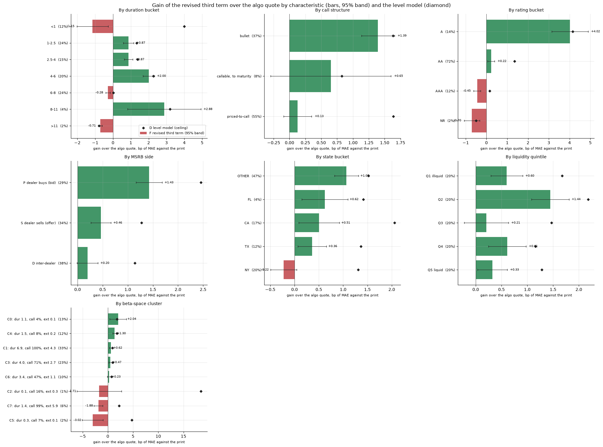

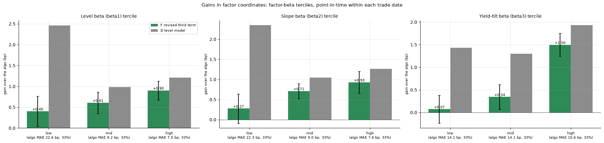

**Notebook evidence — by MSRB side.** The same gains split by the side of the print, P a dealer purchase from a customer (the bid), S a dealer sale (the offer), D inter-dealer.

| **Table 12a. Gain of the revised third term by characteristic and side (bp; * marks \|FM t\| ≥ 2)** | | | |
|---|---|---|---|
| **Segment** | **P bid** | **S offer** | **D inter-dealer** |
| All trades | +1.43* | +0.46* | +0.20 |
| Rating A | +4.75* | +3.57* | +3.88* |
| Rating AA | +1.17* | +0.05 | −0.38* |
| Rating AAA | −0.18 | −0.48* | −0.63* |
| Bullets | +1.49* | +1.32* | +1.38* |
| Callable to maturity | +1.04* | +0.73 | +0.43 |
| Priced to call | +1.39* | −0.21 | −0.44* |
| Duration 4–6 y | +1.67* | +2.00* | +2.32* |
| Duration 8–11 y | +3.11* | +2.90* | +2.80* |
| Duration 6–8 y | −0.78* | −0.01 | −0.18* |
| Duration < 1 y | +5.25* | −2.66* | −3.36* |
| Cluster C5 (0.3 y bullets) | +6.86* | −7.52* | −4.89* |
| Cluster C7 (1.4 y callables) | +3.99* | −3.84* | −3.56* |
| Liquidity Q2 | +2.17* | +1.17* | +1.14* |

**Finding 12 — Outside bullets and single-A, the correction is a bid-side result, and in the short end it flips sign with the side.** Single-A bonds, bullets and the 4 to 11 year callable cells gain on all three sides, so there the quote's error is a level the bond carries whichever way it trades. AA, priced-to-call and the liquidity quintiles gain on the bid and not on the offer. The sub-one-year bucket and the two short clusters gain 4 to 7 bp on the bid and lose 3 to 8 bp on the offer and inter-dealer. The reason is mechanical: the EWMA pools prints from both sides, and in the short end the dealer round trip is large relative to the yield, so the last error from a sale is applied with the wrong sign to the next purchase. The universe side intercept in F cannot fix a cell-specific round trip. The deployable rule therefore needs a side-aware error memory (separate memories per side, or errors demeaned by a cell-level side bias before smoothing), and the shadow gating must be by side as well as by cell.

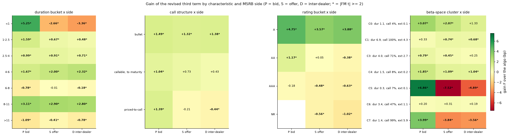

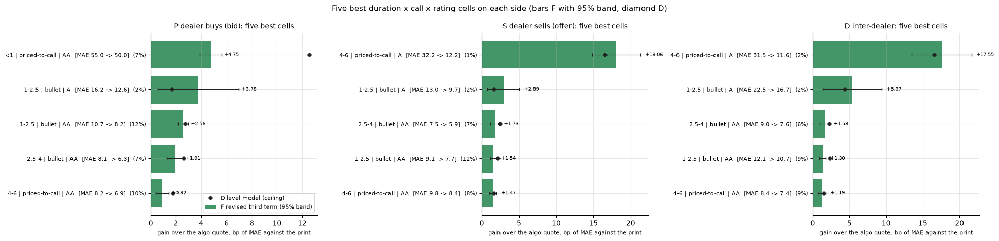

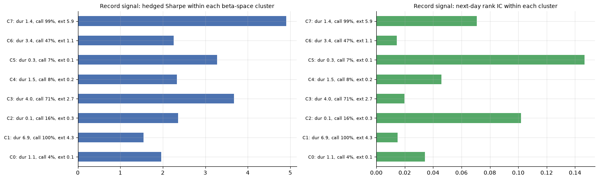

## 5.6 The Quote Band

| **Table 13. Bands around the algo quote, 80% target, three held-out months (344,397 trades)** | | | |
|---|---|---|---|
| **Band** | **Coverage** | **Mean half-width (bp)** | **Efficiency (bp per coverage point)** |
| Fixed (calibrated on training months) | 75.0% | 10.4 | 0.139 |
| **Rolling fixed (rescaled on trailing 10 days)** | **78.2%** | **11.2** | **0.143** |
| Raw quantile GBM | 69.9% | 14.8 | 0.212 |
| Split conformal (previous month) | 70.1% | 14.8 | 0.211 |
| Rolling conformal (trailing 10 days) | 77.3% | 18.1 | 0.234 |
| Around the level model D, rolling fixed | 78.1% | 11.4 | 0.146 |
| Around the level model D, rolling conformal | 77.9% | 15.9 | 0.204 |
| Around the revised third term F, rolling fixed | 78.4% | 12.0 | 0.152 |

**Finding 14 — A rescaled fixed band beats every conditional band we tried.** The fixed band collapses in September (63.8% coverage) because the training months were calmer. Rolling conformal recovers coverage to 77% and is flat across width deciles (0.73 to 0.83), which is what conformal is for, but its mean half-width is 16 to 18 bp and its top width decile averages 70 bp. The fair benchmark, a fixed width rescaled on the same ten-day window, covers 78% at 11.2 bp with no model at all. On efficiency the rolling fixed band is 0.143 to 0.152 against 0.204 to 0.234 for rolling conformal around every mid. The conditional band's shape is right and its level is too wide; until the quantile model is sharper, current practice (a fixed width, now rescaled on a short window) is the right band.

## 5.7 Roll-Forward of Stale Marks

| **Table 14. Rolling a stale mark forward with the factor path (RMSE, bp)** | | | | |
|---|---|---|---|---|
| **Horizon (days)** | **n** | **Stale RMSE** | **Rolled RMSE** | **RMSE reduction** |
| 1 | 1,195,848 | 6.6 | 5.3 | 20% |
| 3 | 1,108,043 | 12.1 | 8.4 | 31% |
| 5 | 1,023,100 | 16.5 | 10.6 | 36% |
| 10 | 838,230 | 23.8 | 14.2 | 40% |
| **At 5 days, by segment** | | | | |
| Duration 1–2.5 y | 131,923 | 13.4 | 5.9 | 56% |
| Duration 2.5–4 y | 128,270 | 12.7 | 4.1 | 68% |
| Duration 4–6 y | 162,238 | 14.0 | 4.0 | 71% |
| Duration 6–8 y | 133,688 | 14.6 | 4.2 | 71% |
| Duration 8–11 y | 42,443 | 13.7 | 5.0 | 64% |
| Duration < 1 y | 401,175 | 20.2 | 15.8 | 22% |
| Callable to maturity | 98,757 | 15.2 | 7.0 | 54% |
| Priced to call | 380,942 | 14.9 | 8.8 | 41% |
| Bullets | 543,401 | 17.8 | 12.1 | 32% |

**Finding 15 — The factor model moves intermediate and long marks; the short end is idiosyncratic.** For bonds with one to eleven years of duration, rolling a five-day-stale mark forward with the factor path removes 56 to 71% of the RMSE. Below one year, which is 40% of bond-days, it removes 22% and drags the universe figure to 36%. This is the strongest single argument for the factor model as marks tooling, and it is already in the identified cells.

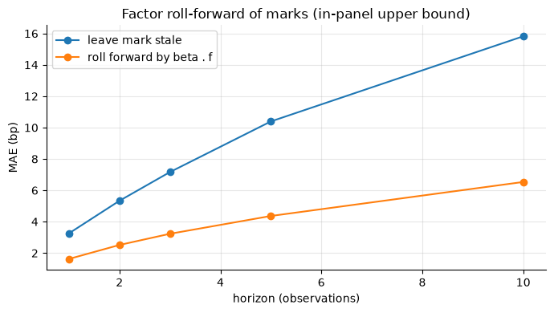

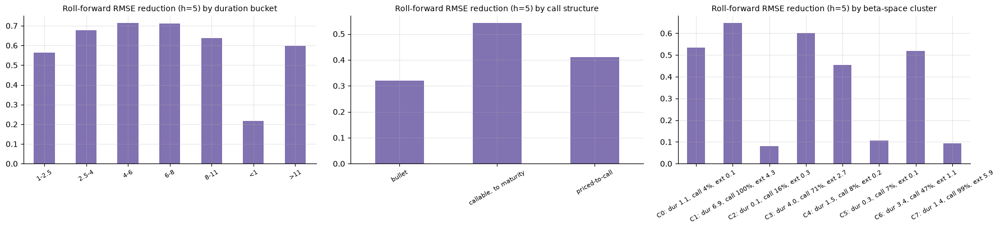

## 5.8 External Benchmarks and Interpretation

**Corporate-bond IPCA reference.** Kelly, Palhares and Pruitt's *Modeling Corporate Bond Returns* applies the same characteristic-conditioned latent-factor architecture to monthly U.S. corporate-bond excess returns and finds, as we do, that a small number of characteristic-driven factors explains most of the common variation and that the loadings are stable. Our daily yield-change target is noisier and our 13-instrument set is smaller; the magnitudes are not comparable, the structure is.

**Attention-factor and muni relative-value references.** The attention-based statistical-arbitrage literature motivates learning economically relevant similarity across assets rather than imposing fixed peer groups; our beta-space clusters and within-cluster rich/cheap ranking follow that principle with the IPCA betas as the learned coordinates. The muni relative-value literature motivates the residual as a conditional fair-value state; the v2.3 peer relative-value signal built on beta-space neighbours was tested and closed because it added nothing to the state-space filter. None of these papers validates the transfer to MSRB prints or the error-correction result; those rest on the tests in Sections 5.3 to 5.5.

# 6. Application to the Market-Making Model

**Audited result.** Three outputs of the programme have cleared the research gates and one has not.

1. **The factor model of record** (K = 3, 13 instruments, monthly refit, two data rules) is stable across versions and cadences and explains the common move in the months when there is one. It is ready as the common-risk layer.
2. **The residual layer** is a marks-and-risk object: the pooled state-space filter predicts the next mark (IC 0.083, hedged Sharpe 6.8), the mark-noise estimate predicts how far prints land from the mark (bootstrap t 11.7), and the factor roll-forward removes 56 to 71% of stale-mark RMSE for 1 to 11 year bonds. It does not predict prints relative to the quote and should not be used as a quote charge.
3. **The algo error correction** C (quote + 0.8 × EWMA of past errors, half-life three prints) lowers held-out MAE by 0.68 bp universe-wide with bootstrap t 6.1, and by 2 to 22 bp in identified single-A, 4 to 6 year and short-bullet cells, while removing the quote's slope-factor loading. It is ready for a bounded shadow deployment in those cells.
4. **The conditional band** is well shaped and too wide; the rescaled fixed band is current best practice. The level model (+1.55 bp) remains a challenger.

**Decision.** Deploy C as a shadow third term in the cells of Table 12 with positive, significant gain (rating A; duration 4 to 6 and 8 to 11 years; bullets 1 to 4 years; the high yield-tilt tercile), with the correction capped and logged, with the sub-one-year and near-call cells excluded, and gated by side: all sides in bullets, single-A and the 4 to 11 year callable cells, bid only elsewhere, until a side-aware error memory replaces the pooled EWMA. Promote the state-space outputs (filtered drift, mark-noise score, factor roll-forward, beta-space comparables) as research and desk tooling with no pricing impact. Keep the level model and the conditional band as challengers behind the same gates. Do not use the residual signal as a quote adjustment.

## 6.1 Market-Making Evaluation Gates

| **Gate** | **Question** | **Required evidence** | **Status for the EWMA rule C** |
|---|---|---|---|
| **1. Signal validity** | Is the error memory stable? | Persistence by gap and side pair; coefficient path over months; FM and block-bootstrap t | Passed: persistence 0.31 to 0.58 in every gap bucket and both side pairs; ρ rises monotonically from 0.77 to 0.84; bootstrap t 6.1 |
| **2. Incremental fair value** | Does it beat the quote on the print? | Held-out MAE by age, side, segment and cell against A; the quote's own last-value term checked; factor loading of the error | Passed in the identified cells; neutral to negative in AAA, 6 to 8 years and below one year; the quote's own term is right-sized (−0.037) |
| **3. Execution utility** | Does bounded use improve quoting? | RFQ replay with fills, adverse selection, inventory, turnover and tail loss, in the shadow cells | Not yet run: the shadow deployment is the test |
| **4. Economic size** | What is it worth? | Par- and duration-weighted dollars of error removed per month, by cell | Measured: $2.5 million a month, 8% of the quote's absolute error, nine tenths in single-A callables (Section 6.3) |

## 6.2 Controlled Integration Path

1. **Shadow third term.** Compute C alongside the live quote for every trade; log the correction, the EWMA state, the age and the cell; no pricing impact.
2. **Cell gating.** Apply the correction only in cells where the trailing-quarter gain is positive and significant, re-evaluated monthly on the same held-out protocol; start with the cells in Table 12.
3. **Bounded challenger.** Cap the correction at a multiple of the cell's recent error sd; exclude sub-one-year and near-call bonds; carry the rolling fixed band as the width.
4. **Production gate.** Require sustained net utility in the RFQ replay, stable calibration of the band, and no deterioration of the factor loading of the corrected error before the term enters the quoting model.

**Candidate mapping for testing, not deployment:**

yquotei,t = yMMD + spreadside + adjlast value + 1[c ∈ C*] · clip[ρewm · EWMA3(ealgoi,<t), −cap(c), +cap(c)]

where C* is the set of validated characteristic cells, ρewm is estimated on prior months (0.84 at the end of this sample) and cap(c) is set per cell. The EWMA is over prior matched prints of the same bond, so the term is zero for a bond with no print history and the rule degrades to the incumbent quote.

## 6.3 Economic Size

The error removed on each held-out trade is converted into dollars of price with par × price/100 × modified duration × 10−4. The par filter drops 1,392 of 537,845 trades with non-finite, non-positive or implausible par; the remaining trades carry $45.5 billion of par over five months.

| **Table 15. Dollar error removed on held-out prints (five months, 536,453 trades)** | | |
|---|---|---|
| **Mid** | **$ removed per month ($k)** | **Par-weighted gain (bp)** |
| Algo quote absolute error, for scale | 30,254 per month | |
| C algo + ρ × EWMA error | **+2,481** | **+0.54** |
| F revised third term | +1,581 | +0.37 |
| G factor-beta correction | −1,353 | −0.34 |
| D level model | +2,693 | +0.97 |
| **By segment, C rule** | | |
| Rating A (14% of trades, $6.3 bn par) | +2,216 | |
| Rating AA (72%, $32.5 bn) | +357 | |
| Rating AAA | −112 | |
| Duration 4–6 y | +1,727 | |
| Duration 8–11 y | +619 | |
| Duration 6–8 y | −13 | |
| Priced to call | +1,694 | |
| Bullets | +447 | |
| **Top cells, F rule** | | |
| 4–6 y, priced to call, A (7,356 trades, $469 mm) | +1,407 | +26.7 |
| 8–11 y, callable to maturity, A (3,125 trades, $173 mm) | +922 | +26.7 |
| 4–6 y, priced to call, AA (47,715 trades, $3.1 bn) | +304 | +1.0 |
| 2.5–4 y, bullet, AA | +215 | +1.4 |

**Audited result.** The EWMA rule removes about $2.5 million a month of the quote's $30 million a month of absolute pricing error on the prints that matched, 8% of the total, with a par-weighted gain of 0.54 bp. The level model removes $2.7 million, so the two-parameter rule captures most of the ceiling in dollars even though it captures less than half in bp, because its gains sit in the long-duration cells. The dollars are concentrated: single-A bonds account for $2.2 million of the $2.5 million, and the two single-A callable cells alone remove $2.3 million a month on $640 million of par, a par-weighted gain of 27 bp. The 6 to 8 year belly, which carries the most par ($15 billion) and the most absolute error ($59 million), gains nothing. By month the rule is negative in May, when the coefficient was estimated on one month of data, and reaches $1.1 million in August. This is an accuracy measure, not a P&L: how much of it a desk captures depends on which quotes are hit, which is the fill model the RFQ replay in Gate 3 supplies.

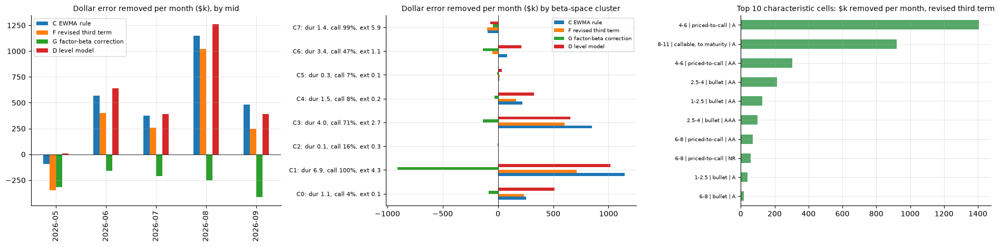

# 7. Limitations and Next Steps

- The results are predictive associations on five out-of-sample months with one dispersion cycle; September is the only stress month. The error-correction coefficient rises every month as training data accumulate, so the universe gain is probably understated, but one quarter of out-of-sample is one quarter.
- The factor model's out-of-sample fit is regime-dependent (0.12 to 0.66 by month). Downstream residual results are results about a residual whose scale moves by a factor of three; the vol scaling and the normalised band score are the controls.
- The residual signal's slope against the prior mark is positive and not significant at the universe level; its information is in the short idiosyncratic end and on the dealer-sale side. It is a marks object and is presented as one.
- Rating is the latest composite value with a fallback rather than a point-in-time history; its loading is small.
- The universe MAE is dominated by sub-one-year and near-call bonds with 40 to 120 bp errors. All headline numbers should be quoted excluding duration below one year, and the cell view is the honest view.
- The level model depends on the side-specific MMD spread change and over-corrects the slope loading; it is a ceiling, not a candidate.
- The conformal band's coverage guarantee assumes exchangeability, which September violated; the rolling version restores coverage at the cost of width.
- The pooled EWMA mixes prints from both sides; in the short end this flips the sign of the gain between bid and offer. A side-aware memory is the first change for the next version.
- The dollar view is an accuracy measure on matched prints, not a P&L.

**Next quarter.** Replace the pooled EWMA with a side-aware, state-space error memory and test cluster-level pooling of the error (Section 7.1); run the shadow third term in the identified cells and collect the RFQ replay evidence for Gate 3; rerun the notebook monthly so the coefficient path and the cell map are refreshed; sharpen the quantile model (print features at signal time, cell indicators) so that the conditional band can compete with the rescaled fixed band on efficiency; add a point-in-time rating history; and extend the out-of-sample window through the next dispersion cycle.

## 7.1 Bringing the correction back inside the factor framework

The EWMA rule is deliberately the simplest object that captures the persistence, and it stands outside the factor model. Three extensions put it back inside, each testable under the same held-out protocol.

1. **A state-space error memory.** Write the algo error at each print as a persistent bond-specific mispricing plus a side offset plus a transient, the same model as Section 4.6 applied to the quote's error on an irregular print clock. The filtered mispricing replaces the EWMA, the side offset absorbs the round trip that flips the short-end sign, and the gain is estimated rather than fixed at a half-life of three prints. The EWMA is the steady-state special case.
2. **Cluster-level pooling.** The top cells show the quote's MAE falling from 33 to 39 bp to 12 to 15 bp, which is a level the whole cell carries, not bond-specific noise, and the slope-factor loading of the error says the same. A point-in-time EWMA of the algo's errors across a bond's beta-space neighbours, excluding the bond itself, tests whether the cell carries the correction; it also gives a correction for bonds with no print history. The direct beta correction G failed because it imposed one universe-wide linear loading; the within-cluster version is the right test.
3. **Within-cluster relative value as a feature.** The bond's filtered residual drift relative to its cluster median, the rich/cheap state the beta space was built to show, enters the correction as a feature estimated on prior months. The universe-level test against prints was negative (Finding 7); the cluster-conditional test has not been run.

# Appendix A. Closed Experiments

Each line is a hypothesis that was tested in an earlier version with a pre-stated metric and closed with a number. They are not re-run in v3.

| **Experiment** | **Version** | **Result** | **Why closed** |
|---|---|---|---|
| Linear AR(1) residual forecast | v4 | Rank IC −0.085 raw; wrong-signed | Mark noise dominates linear moments; replaced by the state-space model |
| ARMA(1,1) via AR(∞) taps | v2.3 | Same object as the state-space filter, worse parameterisation | Redundant |
| LongConv ridge filter | v4, v2.3 | Rediscovers the trailing mean; IC 0.070 | Kept only as a reference forecaster |
| Mark shrinkage toward the factor fit | v4 | No improvement in trade-versus-mark error | Closed |
| Residual-driven quote width (wider/thinner) | v4 | Under-covered (71%) and no MAE gain | The residual does not predict print dispersion; replaced by conformal and rolling fixed bands |
| Quote skew sizing on the trailing-mean signal | v5 | −0.10 bp MAE | Economically negligible |
| Peer relative value in beta-space neighbourhoods | v2.3 | Adds nothing to the filter | Closed |
| Factor hedging of flow exposure | v2.3 | No measurable effect | Closed |
| K sensitivity (K = 2, 4) | v2.3 | K = 4 adds 0.3 points in-sample, unstable loadings | K = 3 fixed |
| Weekly refit | v3.0 | Within 0.3 points of monthly | Monthly fixed |
| Dispersion-regime-conditional Gamma | v3.0 | No gain once the relative dispersion rule was in place | Dropped |
| By-bucket state-space filter as record | v3.0 | IC 0.061 against 0.083 pooled; φ collapses in active quintiles | Pooled filter fixed as record |
| Single-print error correction B | v3.1 | −0.23 bp | One print is too noisy; EWMA kept |
| Side intercepts E | v3.1 | +0.09 bp, shrinking | Not worth a parameter |
| Direct factor-beta correction G | v3.3 | −0.29 bp (t −19) | The mis-pricing is bond-specific; the error history carries it |
| Joint regression of the three residual scores | v3.1 | Collinear (coefficients +6.5, −11.1, +7.2) | Not reported |

# Appendix B. Pre-Registered Choices

Fixed on 2026-10-07 (v3.1, after the v31 review) and not changed by the v32 or v33 results.

| **Choice** | **Value** |
|---|---|
| Number of factors | 3 |
| Refit cadence of record | monthly |
| Level-signal window; activity window | 20; 20 |
| Record residual signal | pooled state-space filter (the by-bucket filter is a diagnostic) |
| EWMA half-life | 3 prints |
| Revised third term | algo + per-side intercept + ρ × EWMA(past algo errors), all estimated on prior months |
| Conformal rolling window; band benchmark | 10 days; fixed width rescaled on the same window |
| Dollar metric | (\|algo error\| − \|mid error\|) × par × price/100 × modified duration × 10−4, per month |
| Breakdown axes | duration, call structure, rating, state, liquidity, factor-beta terciles, 8 beta-space clusters fitted on the first OOS month |
| Dispersion rule | share of \|target − mediant\| > 10 bp above 10% of bonds → zero weight |
| Common-move rule | \|mediant\| > 10 bp → flagged and kept |
| Partial-day rule | bonds priced < 60% of trailing-20-date median → dropped |
| Date weighting | inverse variance, cap 4× |
| Duration instrument | ratio to years to worst |
| Portfolio scaling | volatility |
| Band coverage target | 80% |

# Appendix C. Version Lineage

| **Version** | **What changed** | **What it settled** |
|---|---|---|
| v1, v1.1 | Yield-space IPCA K = 3; transaction audit; quantile-charge validation | Residual information is mark-relative, not quote-relative; no charge model clears the gates |
| v4 | Procrustes alignment; two-horizon signal; MSRB sides fixed; signal-time cut | AR(1) is dead; level model gain falls to 1.1 bp after the signal-time cut; 20% unchanged marks; the June leverage step |
| v5 | Date weighting; state-space model; print-to-print panel; ablations; conditional band | Step gone; SSM best forecaster; algo error persistence 0.585; level model depends on the MMD spread change; band under-covers |
| v2.3 | ARMA, peer RV, flow hedging, K sensitivity, sizing, bootstrap, robustness | All closed with numbers (Appendix A) |
| v3.0 | Clean rebuild; two data rules; cadence study; by-bucket filter as record; error-correction baselines | Data rules catch 04-22 and 05-27; cadence closed |
| v3.1 | Pooled filter as record; last-value diagnostic; baselines E, F; rolling conformal; PIT clusters; segment breakdown | Quote's own term right-sized; EWMA rule +0.68 bp; the gains have a map |
| v3.2 | Beta-tercile and cluster breakdowns; roll-forward by segment; factor loading of the error | Error loads on the slope factor; F removes it |
| v3.3 | Baselines G, H; rolling fixed band benchmark; dollar view with finite par | Direct beta correction fails; rescaled fixed band wins on efficiency |
| v3.4 | Section 12a achievement map: top segments, per-axis grid, factor terciles, scorecard | The "where it works" exhibits come straight from the notebook |
| v3.5 | MSRB side as a breakdown axis; side × characteristic; top cells per side; dollar view on real data | Bid-side result outside bullets and single-A; short end flips sign by side; $2.5 million a month removed, 90% single-A callables |

---

*Artifacts: `artifacts_v3/` (residuals of record, Gamma versions raw and aligned, algo error-correction panel, conformal band panel, beta-space snapshot, results registry). Notebook: `muni_ipca_research_v3.ipynb` on branch `claude/nifty-wright-j93nps`. Reviews of each run: `REVIEW_V4_RESULTS.md`, `REVIEW_V5_RESULTS.md`, `REVIEW_V31_RESULTS.md`, `REVIEW_V32_RESULTS.md`.*
