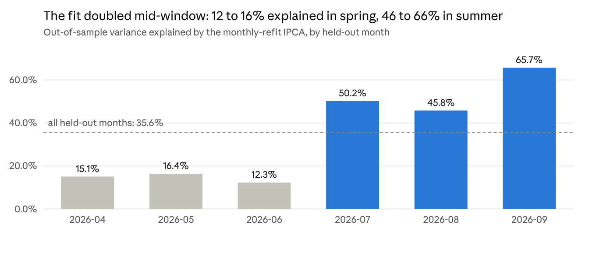
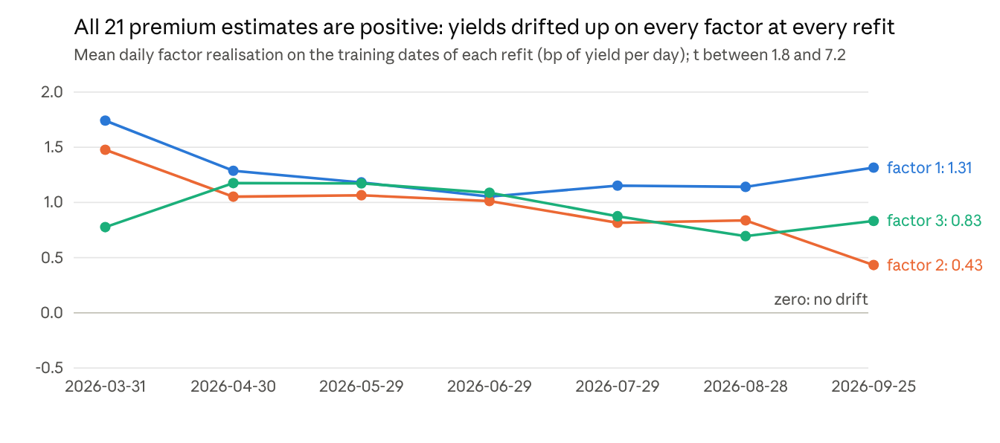

# Muni IPCA: Factor Model and Portfolio Research

2026-10-08 · Jer-Shen Chen · editable copy: https://claude.ai/code/artifact/b5c180ce-87f9-4855-9b6b-63107eb5aa18

## Summary

IPCA with three factors explains 35.6% of the out-of-sample variance of daily evaluated-yield changes across 1.77M bond-days and 53,408 CUSIPs, leaving a 5.3 bp residual. The model earns its place as the hedge and marking layer of the quote, not as a signal, and the premia it implies on this window are the window's own drift.

- **Three factors**: level, term, and yield level (richness and credit), with variance shares 51%, 40% and 9%. Monthly refits beat quarterly and frozen Gammas by 0.1 to 0.3 pp of variance explained: Gamma is stable.
- **Residual dynamics, on hold**: the state-space filter forecasts the next residual with rank IC 0.084 (t 7.5), but the forecast has no value on trades (Fama-MacBeth t 1.2 against the prior mark).
- **The risk layer pays**: hedging the factor-implied move takes the bid-side markout of the same-side mid S from −5.06 bp per print raw to 0.00 bp. Rolling a stale mark forward with the factors cuts its RMSE by 20% after one observation and 40% after ten. The systematic share of daily risk is 49% to 82% by beta cluster.
- **Premia are drift**: every refit estimates a positive mean realisation on all three factors (t 3 to 7), which is yields rising about 1 bp per day over the window. Weekly long-shorts show no premium. The tangency portfolio's annualised Sharpe of 5.5 comes with beta −0.13 to the market: a short-duration bet on that drift. Section 8c now tests it against a trailing trend and its own sign flip.
- **Model D** (the level model) is the most accurate mid, MAE 11.45 bp against 11.60 for S, and loses to S at 0 on dollars (−2,012 $k per month, paired t −2.3). The +595 $k per month contrast reported in Section 12e measures its error-memory features, not the factor features; the factor-feature contrast is added in v5.4.
- **Beta clusters locate the quote P&L**: 87% of S's positive dollars sit in 10 duration x call x rating cells, and the sub-1-year clusters earn 25 to 45 bp per print on the offer. The factor features add nothing to the fill and edge models (Brier unchanged at the third decimal).

Source: notebook run v48 (code v5.0), data 2026-01-05 to 2026-09-30, held-out from 2026-04-01; every held-out number uses only earlier data.

## Data and the model panel

The model panel is the pipeline's Step 3 evaluated-yield panel after the data rules: 1,772,768 bond-days, 53,408 CUSIPs, 181 dates and 21 instruments. The target is the daily change in the evaluated closing yield in basis points, clipped at the tails.

| Item | Value |
| --- | --- |
| Step 3 panel | 1,894,388 rows, 77,379 CUSIPs, 2026-01-05 to 2026-09-30 |
| Model panel | 1,772,768 rows, 53,408 CUSIPs, 181 dates |
| Bond-days with an unchanged evaluation | 20.5% |
| Rating source | final 78%, not rated 18%, composite fallback 4% |
| Geography (share of bond-days) | other states 59%, TX 19%, CA 12%, NY 5%, FL 4% |
| Issuer industry | GO 30%, school districts 27%, general 14%, water 10%, higher ed 4% |
| Bond-days with a print history | 95.7%, median decayed print count 4.6, median trade size 23k par |

Instruments (L = 21): an intercept (the market factor), nine characteristics rank-normalised within each date (duration ratio, premium or discount, lagged yield, years to worst, extension, rating score, 20-day liquidity, trade size, print frequency), a not-rated flag, a no-print flag, four state dummies (CA, NY, TX, FL) and five industry dummies. The largest off-diagonal instrument correlation is 0.49.

Data rules fixed before the run: zero-duration long-maturity rows excluded (0.31%); five sparse dates and one partial-mark day (2026-04-22) dropped; three dispersion days (2026-05-27, 2026-09-17, 2026-09-28) excluded from the fit and shown with and without in the residual exhibits; eight common-move days kept; dates weighted by inverse variance, capped at 4x.

## The IPCA model

The selected specification is K = 3 with Gamma refit monthly on an expanding window; it explains 35.6% of the held-out variance against 35.5% for quarterly refits and 35.3% for a Gamma frozen at the first held-out date.

```latex
r_{i,t} = z_{i,t-1}' \Gamma f_t + \varepsilon_{i,t}, \qquad \Gamma' \Gamma = I
```

The fit is alternating least squares on per-date cross-products with 180 dates and 1.77M observations. In-sample variance explained rises from 21.9% at K = 1 to 25.1% at K = 3 and 25.6% at K = 5; the third factor is the last one that adds more than half a point. Gamma versions are aligned across refits by orthogonal Procrustes, which halves the across-version spread of the loadings (sd 0.027 raw, 0.015 aligned), so factor labels, betas and paths are continuous through the sample.

| Instrument | Factor 1 | Factor 2 | Factor 3 |
| --- | --- | --- | --- |
| market (intercept) | +0.94 | −0.33 | −0.08 |
| lagged yield | −0.17 | −0.22 | −0.89 |
| years to worst | +0.26 | +0.76 | −0.10 |
| extension | +0.15 | +0.48 | −0.31 |
| duration ratio | −0.04 | −0.11 | +0.19 |
| premium or discount | +0.02 | −0.13 | −0.09 |
| rating score | −0.01 | −0.03 | −0.14 |

Every other instrument loads below 0.14 in absolute value. Factor 1 is the level of the market, factor 2 is term and extension against the level, factor 3 is the yield level itself: high-yielding bonds move with it, so it is the richness and credit factor. Variance shares over the full sample are 51%, 40% and 9%. The factor-mimicking portfolios have gross weight 2.7 to 3.1 and effective breadth of 4,800 to 6,500 bonds per day.



*Source: notebook run v48, Section 5; six held-out months, 2026-04 to 2026-09.*

The overall 35.6% averages two regimes: the three spring months, when the cross-section moved idiosyncratically, and the three summer months, when a common move dominated. Monthly refits track the change, so the residuals of record stay on the same Gamma lineage throughout.

## Residuals of record and residual dynamics (on hold)

The residuals of record are 1,195,848 held-out bond-days over 123 dates and 7 Gamma versions with a standard deviation of 5.28 bp; they carry a slow per-bond deviation that a state-space filter forecasts with rank IC 0.084, and that forecast has no value on trades, so the residual component is on hold and its cells are cached.

The pooled autocorrelation of the residual is −0.052 Pearson and +0.058 Spearman at lag 1, and the rank autocorrelation stays between +0.03 and +0.08 out to lag 10: the bond's accumulated deviation carries the information, not yesterday's increment. The body of the distribution continues (continuation ratio 0.10 to 0.15 in the central bins) while the tails revert (−0.05 in the outer 1%).

| Activity bucket (trailing vol) | Bond-days | Median vol (bp) | Lag-1 rank IC | t |
| --- | --- | --- | --- | --- |
| L1 quiet | 181,363 | 2.5 | 0.096 | 4.4 |
| L2 | 182,510 | 3.1 | 0.088 | 3.8 |
| L3 | 182,100 | 3.4 | 0.051 | 2.7 |
| L4 | 181,638 | 3.9 | 0.035 | 2.0 |
| L5 active | 178,906 | 5.5 | 0.089 | 5.7 |

Two forecasters on expanding monthly folds: the trailing 20-day mean reaches rank IC 0.081 (t 7.9) and the pooled state-space filter, an AR drift plus mark noise, 0.084 (t 7.5) with drift persistence 0.98 to 1.00 per observation, mark-noise sd 0.4 to 0.7 bp and white-noise sd 1.8 to 2.4 bp. Out-of-sample R² against zero is nil for both: the signal ranks bonds, it does not size moves.

On 624,171 matched trades joined to the latest prior residual, the state-space rank has Fama-MacBeth t 1.2 (bootstrap 1.1) against the trade minus prior mark, and the trailing-mean rank has the opposite sign (t −4.2): bonds that cheapened against the model print richer, not cheaper. The joint regression keeps the one-day residual rank (t 2.8) and the state-space rank (t 2.8) with the trailing mean negative (t −5.0). None of this moved a quote in the dollar tests.

## The risk layer: hedged markout, the inventory charge, roll-forward

Hedging the factor-implied move is where the model pays. On the bid, the same-side mid S marks out at −5.06 bp per print raw five days after a fill and 0.00 bp once the factor part of the move is removed; on the offer, +11.01 raw and +7.21 hedged. The raw numbers were the common yield move, not the quote.

Under the algo quote the bid-side fills (67% of bid prints) see the mark move −8.87 bp against the position in five days, of which −8.58 bp is factor-implied and −0.21 bp is residual; the offer-side fills see +7.29 bp, of which +6.32 bp is factor-implied. Adverse selection in the residual is small on both sides: the inventory risk a fill carries is almost entirely systematic, which is what a factor hedge removes.

| Beta cluster (2026-09-30) | Bonds | Systematic sd (bp/day) | Idiosyncratic sd (bp/day) | Systematic share | Mark-noise sd (bp) |
| --- | --- | --- | --- | --- | --- |
| C0: dur 0.1, call 17% | 77 | 3.48 | 3.56 | 49% | 0.12 |
| C6: dur 0.4, call 7% | 922 | 3.37 | 3.36 | 51% | 0.10 |
| C3: dur 1.1, call 4% | 2,547 | 3.36 | 2.95 | 57% | 0.10 |
| C5: dur 1.5, call 7% | 286 | 3.37 | 2.61 | 63% | 0.11 |
| C7: dur 1.7, call 98%, ext 5.8 | 361 | 3.29 | 2.33 | 67% | 0.12 |
| C4: dur 3.3, call 47% | 259 | 3.47 | 2.07 | 74% | 0.09 |
| C1: dur 4.0, call 69% | 2,341 | 3.42 | 1.63 | 81% | 0.08 |
| C2: dur 6.9, call 100% | 2,838 | 3.56 | 1.66 | 82% | 0.08 |

The factor covariance on that date is 11.4, 9.0 and 2.0 bp² per day on the diagonal with small negative off-diagonals; systematic risk is beta' Sigma beta and idiosyncratic risk the trailing residual variance. An inventory charge built from this snapshot prices the systematic part with the hedge cost and the idiosyncratic part with the expected holding time.

| Horizon (observations) | Stale-mark MAE (bp) | Rolled-forward MAE (bp) | RMSE reduction |
| --- | --- | --- | --- |
| 1 | 3.26 | 1.63 | 20% |
| 2 | 5.33 | 2.52 | 26% |
| 3 | 7.16 | 3.23 | 31% |
| 5 | 10.39 | 4.37 | 36% |
| 10 | 15.82 | 6.54 | 40% |

Rolling a stale evaluation forward with the factor move is an in-panel upper bound, since the factors are observed on the same dates; it halves the absolute error at every horizon. Coverage of the evaluation markout is 36% of customer prints at five days, so the hedged numbers above are read beside the trade-based markout in the notebook, which covers 84%.

## Factor premia as expected returns (Section 8b)

Every refit estimates a positive mean realisation on all three factors, with t between 3 and 7 on 60 to 190 training days: yields drifted up by about 1 bp per day over the window, and on 26 weekly rebalances no sort can tell that drift from a premium.



*Source: notebook run v48, Section 8b; seven refits, Gamma as of 2026-03-31 to 2026-09-25.*

The test follows Kelly, Palhares and Pruitt: the expected return of a bond over a holding period is carry minus duration times beta times the mean factor realisation, with the mean taken on the training dates of the Gamma in force. Bonds are sorted into quintiles on the first date of each week and month and held to the next; the target is the evaluated-price total return with accrued coupon, which tracks the duration approximation with correlation 0.99.

| Signal (weekly, 26 rebalances) | Long-short, equal weight (bp) | t | Long-short, DV01-balanced (bp) | t |
| --- | --- | --- | --- | --- |
| Factor premium | +13.3 | 1.3 | +18.6 | 1.5 |
| Carry only | −23.7 | −2.1 | −4.6 | −1.3 |
| Premium + carry | +6.8 | 0.9 | +20.2 | 1.8 |
| Premium within duration quintile | +2.3 | 1.4 | +7.3 | 2.5 |
| Premium in yield space | +0.8 | 0.2 | +7.1 | 2.1 |
| State-space residual signal (reference) | +10.5 | 2.3 | +3.5 | 2.0 |

Against the equal-weighted universe, the long legs carry beta 0.5 to 1.6 with alpha inside ±3 bp per period, and the DV01-balanced long-shorts carry beta −3.4 to −3.6: they are short-duration positions in a window where yields rose. Monthly rebalancing (5 periods) flips the signs. The pre-registered reading, weekly t above 2 with monotone quintiles and the same sign monthly, is met by nothing.

| Factor portfolio (yield space, 123 held-out days) | Mean (bp/day) | Sharpe (annualised) | Beta to market | Alpha (bp/day) | Alpha t |
| --- | --- | --- | --- | --- | --- |
| Tangency (model-implied) | +0.65 | +5.5 | −0.13 | +0.53 | 3.3 |
| Equal weight of factors | −0.60 | −4.7 | +0.11 | −0.51 | −2.8 |
| Factor 1 alone | −1.07 | −4.3 | +0.73 | −0.44 | −1.7 |
| Market (long all bonds) | −0.86 | −3.7 | 1.00 | 0.00 |  |

The tangency weights are nearly identical at all seven refits (about −0.19, −0.25, −0.56): one fixed short of the factors that paid in every month of a window where all three drifted up. Its alpha t of 3.3 on 123 days is what a six-month trend produces; Section 8c reads it against a trailing trend and a sign flip, and checks whether any refit's premium estimate had the sign of the next month's realisation.

## Portfolio research on the fixed window (Section 8c)

The sample cannot be extended, so Section 8c asks what 125 held-out days and fifty thousand bonds can say about expected returns and reads every answer against what noise produces on the same window. It is built and smoke-tested (v5.2); its numbers on the real data arrive with the next run.

- **Every held-out day forms sorts.** Quintiles on each signal from data up to the formation date, held 1, 5, 10 and 20 business days. The holding periods overlap, so inference is Newey-West with h − 1 lags beside the moving-block bootstrap. The effective number of independent periods is still the window divided by h.
- **Thirteen point-in-time signals**: the factor premium, carry and both; the bond's own 20-day momentum and 5-day reversal; the factor-implied move over 20 days; residual value (the trailing residual mean, cheap = long); the state-space forecast; low volatility; illiquidity (print frequency); credit; term; and mark staleness, a data diagnostic rather than a signal.
- **Ranked within duration quintile** as the reading of record, with the raw ranking beside it: on a window where yields trended one way a raw sort is a duration bet, and the gap between the two is its size.
- **Calendar-time daily long-shorts** at the five-day hold, as the average of the overlapping cohorts, against the equal-weighted market: Sharpe, beta, alpha, drawdown, months positive, and the loadings on the three factor realisations.
- **The placebo sets the bar.** Random signals, independent per bond-day and fixed per bond, go through the identical pipeline. The pre-registered single test is the state-space signal, duration-neutral, h = 5, against the placebo's 97.5th percentile of |t|. The zoo as a whole is 104 tests, read against the expected maximum of |t| under noise, about 3.0; anything that clears it is a hypothesis for the next window, not a result.
- **The tangency portfolio against its placebos**: the fold premium, the same weights sign-flipped, a trailing 20- and 60-day trend in the factor realisations (time-series momentum, no model), and equal weight; each refit's premium estimate is checked for sign agreement with the realised mean of its test month.
- **Six exhibits**: signal correlation, persistence and coverage; the zero mass of evaluated-price returns; quintile monotonicity with bootstrap bands; IC by horizon, rolling and by month; cumulative long-shorts, drawdowns, beta against alpha and factor loadings; the placebo distribution with the zoo's t values marked; and where the top sorts earn their return by rating, duration, call structure and trailing vol.

What to read first on the real output: the stale-mark sort across horizons. An evaluated-price artefact shows as a strong one-day effect that fades by ten days, and that pattern contaminates any signal correlated with staleness.

## Model D: the level model with factor features

The level model is the most accurate mid of the nineteen tested and the least profitable of the S family: MAE 11.45 bp against 11.60 for S, and −2,012 $k per month against S at 0 on the realised round trip (paired daily-dollar t −2.3). Its +595 $k per month over D− is the value of its error-memory features; the factor-feature contrast has not been run yet.

D is a gradient-boosted model (LightGBM, L1 loss, 150 trees) fitted each month on the prior months, predicting the print's spread to the MMD curve from the print history, the algo's own derived inputs, the bond's characteristics, its three IPCA betas and instruments, and the same-side error memory that S uses. D− drops the error memory and keeps everything else, the factor features included. Both carry the factor model; the contrast between them is the memory.

| Mid at 0 | MAE vs print (bp) | Next real print ($k/month) | Round trip ($k/month) | Paired $ t vs S at 0 |
| --- | --- | --- | --- | --- |
| A algo quote | 12.95 | −1,755 | 4,812 | −3.5 |
| S same-side memory | 11.60 | 1,560 | 7,768 |  |
| D level model | 11.45 | −404 | 5,756 | −2.3 |
| D− without error memory | 11.94 | −1,057 | 5,161 | −2.6 |

The lower error with fewer dollars is not a contradiction. D centres its quote on where the print lands, so it fills the prints that are adverse after the fill; S moves the quote with the last same-side error and keeps the edge that the round trip pays. The accuracy criterion stays in Section 10 as a diagnostic; selection is on paired dollars.

The labels in Section 12e read "with vs without factor features" for this pair, which is wrong. Version 5.4 relabels the pair and adds D0, the level model without the betas and instruments, so that D against D0 is the factor-feature contrast on the same paired-dollar objective. Until that run, the factor model's economic value inside the mid is unmeasured.

## Where the factor model shows in the quote P&L

The betas locate the P&L rather than predict it: 87% of S's positive hedged dollars come from 10 of 27 duration x call x rating cells, only one cell loses, and the beta clusters separate the bonds that pay 25 to 45 bp per print on the offer from the bonds that pay 2 to 5.

| Beta cluster | Prints | S hedged P&L, bid (bp/print) | S hedged P&L, offer (bp/print) | S dollars per month, offer ($k) |
| --- | --- | --- | --- | --- |
| C6: dur 0.4, call 7% | 6,521 | −15.2 | +44.5 | 17 |
| C7: dur 1.7, call 98%, ext 5.8 | 21,745 | −2.4 | +24.5 | 41 |
| C3: dur 1.1, call 4% | 48,564 | +1.1 | +8.6 | 171 |
| C5: dur 1.5, call 7% | 38,312 | −0.1 | +5.9 | 153 |
| C1: dur 4.0, call 69% | 78,294 | +0.9 | +5.0 | 481 |
| C4: dur 3.3, call 47% | 29,792 | −0.3 | +4.6 | 112 |
| C2: dur 6.9, call 100% | 108,237 | +0.3 | +3.7 | 1,099 |

By beta tercile the pattern is the same: the low tercile on factors 1 and 2 (the short bonds) pays 7.4 to 7.6 bp per print under S, the high tercile 1.8 to 2.1. The bid side is flat to negative everywhere; the dollars come from the offer and from the long callable cluster C2 by volume.

The factor features do not improve the fill or edge models. The gradient-boosted fill curve removes 8% of the desk curve's Brier at zero concession and 25% at +30 bp; adding the betas, the residual and the state-space signal changes the Brier by less than 0.001. The round-trip edge model has out-of-sample R² 0.303 on trade features and 0.308 with the factor features. On production's own 64,270 requests the GBM with factor features removes 42% of the logged fill probability's Brier, the desk curve alone 34%, and the cell curve keyed on beta cluster 29% against 24% for the production-style key: the cluster is the better grouping key, by five points of Brier.

## Conclusions and the research agenda

The factor model is a risk model: it hedges, marks and groups, and the one place it could add alpha, the premia, is indistinguishable from the window's drift.

1. **Deploy it as the risk layer.** Hedge the factor-implied move on inventory, roll stale evaluations forward with the factors, and build the inventory charge from the covariance snapshot: systematic risk times the hedge cost, idiosyncratic variance times the expected holding time.
2. **Read the premia against the placebo.** Section 8c's next run decides whether any sort survives the trend and sign-flip placebos and whether the premium estimate of one month has the sign of the next. The pre-registered single test is the state-space signal at five days.
3. **Run the factor-feature contrast for D.** D against D0 on paired dollars is the measurement Section 12e meant to make. If D0 matches D, the betas are redundant given the characteristics in a level model; if not, the value is in the mid level and nowhere else.
4. **Use the beta cluster as the fill-curve key.** It removes five more points of Brier than the production-style key on production's own requests, and it can carry the residual-deviance shift.
5. **Keep the residual component on hold** until a trade-based test shows value; the cells are cached and cost nothing to carry.

Out of scope here and kept in the notebook: the quote rules and the interaction ladder (Section 10), the fill and edge models (11b), the production objective and its replicas (12c), the RFQ ledger (12d) and the one-sample engine comparison (12e), except where cited above.

## Appendix: pre-registered choices, bars and provenance

Every choice below was fixed before the run it applies to and is stored in the notebook's results registry.

| Choice | Value |
| --- | --- |
| Specification | K = 3, 21 instruments, monthly refit, Procrustes-aligned Gamma, inverse-variance date weights capped 4x |
| Residual signal of record | pooled state-space filter, trailing-20 level signal as reference |
| Markout | fill if the print crosses the quote; evaluation mark at 5 business days, factor-hedged; trade mark at the next real print, raw |
| Per-print bar | +0.10 bp per print over S, moving-block bootstrap t > 3 (5-day blocks, 500 draws), positive in at least 4 of the held-out months |
| Dollar bar | positive monthly paired daily-dollar difference against S at 0, bootstrap t > 3, at least 4 months |
| Premia (8b) | weekly long-short t > 2, monotone quintiles, same sign monthly |
| Zoo (8c) | duration-neutral, h = 5; single test above the placebo 97.5th percentile of the long-short Newey-West t; the zoo against sqrt(2 ln N) |

Provenance: the numbers are from the v48 html, which ran notebook v5.0 (commit 7d2e1cc) cold in 43 minutes; the code of record is v5.4 (commit ba0a674) on branch claude/nifty-wright-j93nps, which adds the stage cache for the residual and level stages (v5.1), Section 8c (v5.2), the 12c desk-curve rewrite (v5.3) and the D0 level model (v5.4) without changing any number above. Section 8c and the D against D0 contrast report with the next run.
